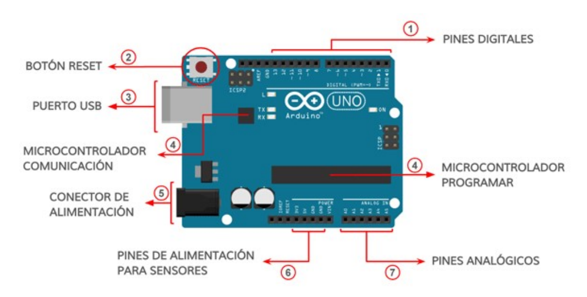
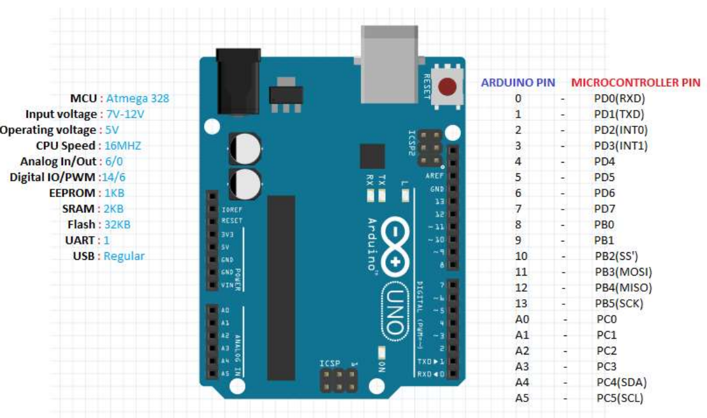

# Microcontroladores con Arduino
### **Proyecto Semáforo | Robótica | SMR1**

---

## Indice  

1. [Microcontroladores](#1-microcontroladores)
2. [Introducción a Arduino](#2-introduccion-a-arduino)
3. [Partes de una placa Arduino UNO](#3-partes-de-una-placa-arduino-uno)
4. [Conceptos esenciales](#4-conceptos-esenciales)
5. [Primer programa: LED parpadeante](#5-primer-programa-led-parpadeante)
6. [Sensores y Actuadores](#6-sensores-y-actuadores)
7. [Flujo de trabajo con Arduino](#7-flujo-de-trabajo-con-arduino)
8. [Comunicación serial](#8-comunicacion-serial)
9. [Lectura de sensores analógicos](#9-lectura-de-sensores-analogicos)
10. [Uso de librerías en Arduino](#10-uso-de-librerias-en-arduino)
11. [Proyecto: Semáforo con Arduino](#11-proyecto-semaforo-con-arduino)

---

## 1. Microcontroladores

Un **microcontrolador** es un ordenador en un solo chip. Integra:
- **CPU** para procesar instrucciones
- **Memoria** para almacenar programas
- **Puertos de E/S** para comunicarse

>**Analogía:** Es el **cerebro** de un robot. Recibe información de sensores, la procesa, y envía órdenes a actuadores.  

```ENTRADA → PROCESO → SALIDA```

1. **Entrada (SENSORES):** Sensores analógicos y digitales. Analogía: sentidos humanos  
2. **Proceso (LOGICA PROGRAMABLE):** El **Sketch** controla la lógica; CPU y memoria. Analogía: cerebro humano  
3. **Salida (ACTUADORES):** Actuadores físicos. Analogía: músculos humanos  

>**Bucle infinito (loop)** – Lectura → comparación → acción → repetición.

**Ejemplo:** Termostato automático con sensor LDR

---

## 2. Introducción a Arduino<a name="2-introduccion-a-arduino"></a>

**Arduino** es una plataforma de código abierto para **programar microcontroladores** fácilmente.

**Ventajas:**
- Fácil de aprender
- Bajo costo
- Gran comunidad
- Multiplataforma

**Modelos comunes:**
- **Arduino UNO** (el más usado)
- **Arduino Nano** (compacto)
- **Arduino Mega** (más pines)

---

## 3. Partes de una placa Arduino UNO  

Arduino UNO es una placa de microcontrolador basada en el **ATmega328P.** Contiene todo lo necesario para el funcionamiento del microcontrolador:  

    ARDUINO UNO
    ┌─────────────────┐
    │   Microcontrol  │ ← ATmega328P
    │                 │
    │ Pines Digitales │ ← 0-13
    │ Pines Analógicos│ ← A0-A5
    │                 │
    │ USB  Power  GND │ ← Conexiones
    └─────────────────┘  
  
- 14 pines de entrada/salida digitales (de los cuales 6 se pueden usar como salidas PWM)
- 6 entradas analógicas
- 1 resonador cerámico de 16 MHz
- 1 conexión USB
- 1 conector de alimentación
- 1 conector ICSP
- 1 botón de reinicio

Simplemente conéctalo a un ordenador con un cable USB o aliméntalo con un adaptador de CA a CC o una batería para empezar.   

   
    
**Componentes clave:**
1. **Microcontrolador ATmega328P** - El cerebro
2. **14 Pines Digitales (Entradas/Salidas)** - Para señales ON/OFF
3. **6 Pines Analógicos (Entradas)** - Para valores variables
4. **Conector USB** - Programación y alimentación
5. **Alimentación** - 5V, 3.3V, GND

---  

**Desglose de pines de la placa microcontroladora Arduino UNO R3:**  

    

[Anatomía de la placa Arduino UNO](https://docs.arduino.cc/tutorials/uno-rev3/board-anatomy/)

---

## 4. Conceptos esenciales

### 4.1. Digital vs Analógico
| Tipo | Valores | Ejemplo |
|------|---------|---------|
| **Digital** | 0 ó 1 | Interruptor |
| **Analógico** | 0-1023 | Potenciómetro |

### 4.2. Voltajes
- **HIGH** = 5V (ON)
- **LOW** = 0V (OFF)

### 4.3. PWM (Modulación por Ancho de Pulso)
Permite simular salidas analógicas en pines digitales.

---

## 5. Primer programa: LED parpadeante

### Material necesario:
- Arduino UNO
- LED
- Resistencia 220Ω
- Cables

### Conexión:
- LED (+) → Pin 13
- LED (-) → GND (con resistencia)

### Código:

```cpp
void setup() {
  pinMode(13, OUTPUT);  // Configura pin 13 como salida
}

void loop() {
  digitalWrite(13, HIGH);  // Enciende LED
  delay(1000);             // Espera 1 segundo
  digitalWrite(13, LOW);   // Apaga LED
  delay(1000);             // Espera 1 segundo
}
```

## Funciones básicas:

**`setup()`** → Se ejecuta una vez al inicio del programa  
**`pinMode()`** → Configura el pin como entrada o salida  
**`loop()`** → Se repite continuamente después del setup  
**`digitalWrite()`** → Escribe HIGH (5V) o LOW (0V) en un pin  
**`delay()`** → Pausa el programa en milisegundos  

---  

## 6. Sensores y Actuadores

### Sensores comunes (Entradas):
- **Pulsador** - Entrada digital simple
- **Potenciómetro** - Valor variable (analógico)
- **LDR** - Sensor de luz
- **HC-SR04** - Sensor de distancia ultrasónico
- **DHT11** - Sensor de temperatura/humedad

### Actuadores comunes (Salidas):
- **LED** - Indicación visual
- **Buzzer** - Generador de sonido
- **Motor DC** - Movimiento continuo
- **Servomotor** - Control de posición angular
- **Pantalla LCD** - Visualización de texto

---

## 7. Flujo de trabajo con Arduino

### Pasos básicos:
1. **Conecta** Arduino al PC con cable USB
2. **Abre** Arduino IDE
3. **Escribe** tu código
4. **Verifica** (compila sin errores)
5. **Sube** el código a la placa
6. **Observa** el resultado

### Configuración necesaria:
- **Herramientas → Placa → Arduino Uno**
- **Herramientas → Puerto → COMX** (Windows)

---

## 8. Comunicación serial<a name="8-comunicacion-serial"></a>

### Para depurar y ver datos:

```cpp
void setup() {
  Serial.begin(9600);  // Inicia comunicación a 9600 baudios
}

void loop() {
  Serial.println("Hola Arduino");  // Envía texto
  delay(1000);
}
```


### Configuración del Monitor Serial:

**En el IDE de Arduino:**
- **Herramientas → Monitor Serial**
- **Velocidad → 9600 baudios**

**Para que funcione correctamente:**
1. El código debe incluir `Serial.begin(9600)` en `setup()`
2. Seleccionar la misma velocidad en el Monitor Serial
3. Conectar Arduino al puerto correcto antes de abrir el monitor

---  

## 9. Lectura de sensores analógicos<a name="9-lectura-de-sensores-analogicos"></a>

### Ejemplo con potenciómetro:

```cpp
int valor = 0;

void setup() {
  Serial.begin(9600);
}

void loop() {
  valor = analogRead(A0);
  Serial.println(valor);
  delay(100);
}
```

### Valores analógicos en Arduino:

- analogRead() devuelve valores de 0 a 1023
- 0 corresponde a 0V
- 1023 corresponde a 5V
- Valor intermedio = Voltaje proporcional

### Conversión a voltaje:

```cpp
float voltaje = valor * (5.0 / 1023.0);
Serial.print("Voltaje: ");
Serial.println(voltaje);
```

---  

## 10. Uso de librerías en Arduino<a name="10-uso-de-librerias-en-arduino"></a>

### Cómo incluir una librería:
```cpp
#include <NombreLibreria.h>
```

### Librerías comunes  
```cpp  
#include <Servo.h>           // Control de servomotores
#include <LiquidCrystal.h>   // Pantallas LCD
#include <DHT.h>             // Sensores DHT11/DHT22
#include <Wire.h>            // Comunicación I2C
#include <Stepper.h>         // Motores paso a paso
```
### Instalación de librerías:
- Sketch → Incluir Librería → Gestionar Librerías
- Buscar el nombre de la librería
- Seleccionar la versión más reciente
- Instalar

### Ejemplo con Servomotor:  

```cpp  
#include <Servo.h>

Servo miServo;

void setup() {
  miServo.attach(9);
}

void loop() {
  miServo.write(90);
  delay(1000);
  miServo.write(180);
  delay(1000);
}
```

---


## 11. Proyecto Semáforo con Arduino<a name="11-proyecto-semaforo-con-arduino"></a>

### Material necesario:
- Arduino UNO
- 3 LEDs (rojo, amarillo, verde)
- 3 resistencias de 220Ω
- Protoboard y cables

### Conexiones:
- LED Rojo → Pin 8
- LED Amarillo → Pin 9  
- LED Verde → Pin 10
- GND de cada LED → Resistencia → GND de Arduino

### Código:
```cpp
int rojo = 8;
int amarillo = 9;
int verde = 10;

void setup() {
  pinMode(rojo, OUTPUT);
  pinMode(amarillo, OUTPUT);
  pinMode(verde, OUTPUT);
}

void loop() {
  // Verde encendido
  digitalWrite(verde, HIGH);
  delay(5000);
  digitalWrite(verde, LOW);
  
  // Amarillo encendido
  digitalWrite(amarillo, HIGH);
  delay(2000);
  digitalWrite(amarillo, LOW);
  
  // Rojo encendido
  digitalWrite(rojo, HIGH);
  delay(5000);
  digitalWrite(rojo, LOW);
}
```  
---
