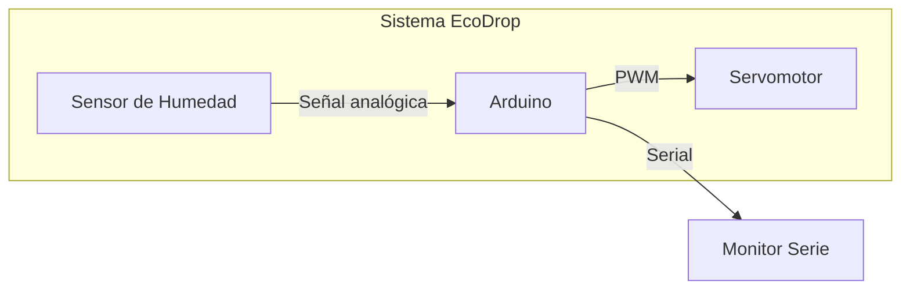
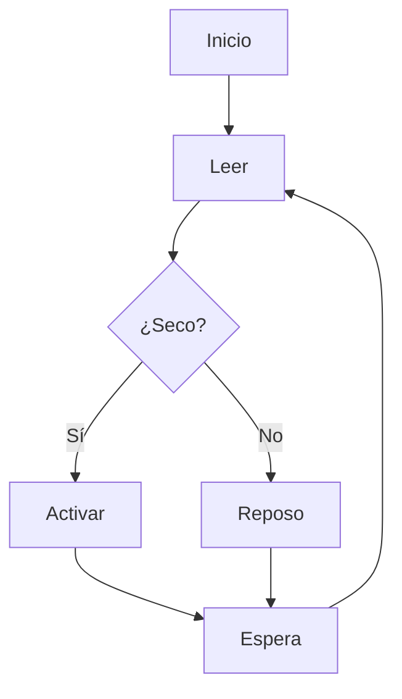
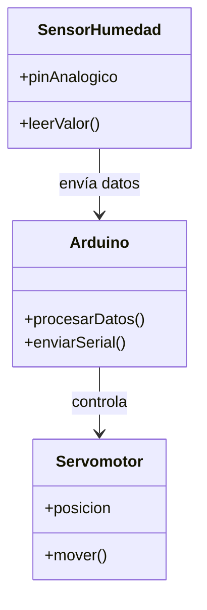
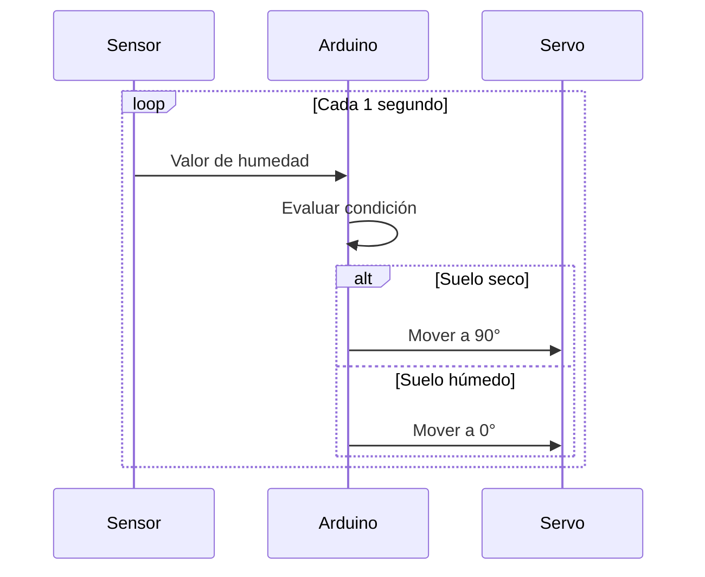
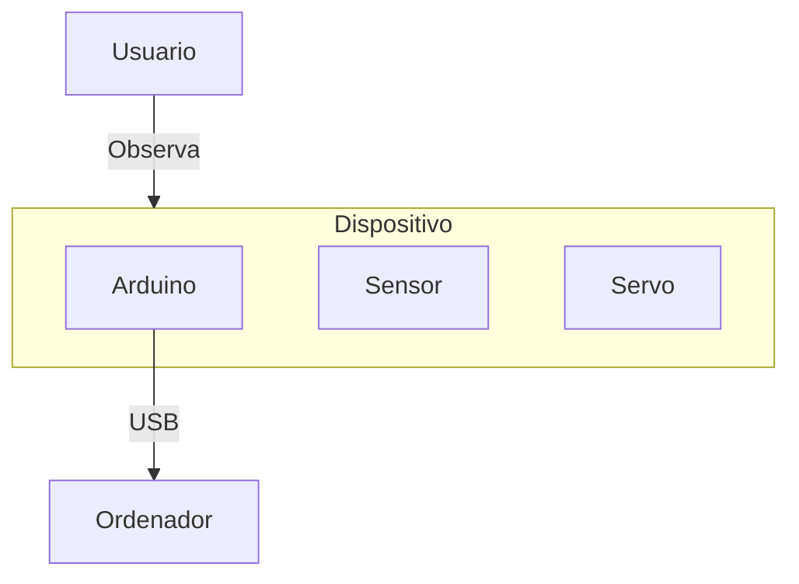

-orange?style=for-the-badge)

  
  
<div align="center">   
 
# Proyecto tecnológico 

</div>  

```Circuito electrónico (Arduino) + Lógica programable (C++) + Impresión 3D + Integración en proyecto ágil```  

## EcoDrop SMR: S 

**EcoDrop SMR** es un sistema automatizado que monitoriza la humedad del suelo y activa un mecanismo de riego simulado mediante un servomotor.

Diseñado como proyecto educativo para **1º SMR**, integra:

- Electrónica básica
- Programación en Arduino
- Diseño e impresión 3D
- Metodologías ágiles

### Objetivo
Dispositivo que mide la humedad del suelo y simula el riego mediante un servomotor o LEDs.

### Tecnologías utilizadas
- Arduino
- Sensor de humedad YL-69
- Servomotor SG90
- Diseño 3D (Tinkercad)
- Impresión 3D

### Estructura del proyecto
- `/src` → Código Arduino
- `/docs` → Documentación técnica
- `/stl` → Archivos de impresión 3D
- `/fritzing` → Esquemas electrónicos
- `/images` → Bocetos y capturas

### Funcionamiento
1. El sensor mide la humedad
2. Si el suelo está seco → activa servo
3. Si está húmedo → permanece en reposo

---

# EcoDrop SMR

Sistema automatizado de riego inteligente basado en Arduino para entornos educativos y oficinas.

---

## Descripción

EcoDrop SMR es una solución IoT básica orientada a la monitorización de humedad del suelo y activación automática de riego simulado. El sistema integra hardware, software embebido y diseño físico mediante impresión 3D.

---

## Características

- Monitorización de humedad en tiempo real
- Activación automática mediante servomotor
- Diseño modular y escalable
- Carcasa personalizada mediante impresión 3D
- Bajo coste de implementación

---

## Arquitectura del sistema  

# Tabla resumen de diagramas UML aplicados al proyecto

| Diagrama UML | Propósito | Aplicación en el proyecto |
|--------------|-----------|----------------------------|
| **Diagrama de casos de uso** | Representar interacciones entre actores y el sistema | Usuario (riego manual/monitoreo) y sistema (lectura de sensores, activación de bomba) |
| **Diagrama de clases** | Modelar estructura estática del software | Clases: `SensorHumedad`, `BombaRiego`, `Controlador`, `LED_Estado` |
| **Diagrama de secuencia** | Mostrar interacciones temporales entre objetos | Secuencia de lectura del sensor → envío a controlador → activación de bomba |
| **Diagrama de actividades** | Flujo de control del sistema | Ciclo: leer humedad → comparar umbral → regar si es necesario → esperar |
| **Diagrama de estados** | Estados posibles de un objeto | Estados del sistema: `Reposo`, `Midiendo`, `Regando`, `Alerta` |
| **Diagrama de despliegue** | Arquitectura física del sistema | Nodo: ESP32/Arduino, sensores, bomba, servidor IoT (opcional) |  
| **Diagrama de flujo** | Secuencia lógica de decisiones y acciones | Ciclo principal: medición → comparación → activación de riego → espera |  


### 1 - Diagrama de Arquitectura  



### 2 - Diagrama de FLujo (Lógica del Sistema)  



### Sketch

```cpp

#include <Servo.h>

const int sensorPin = A0;
int valorHumedad = 0;
Servo miServo;

void setup() {
  Serial.begin(9600);
  miServo.attach(9);
  miServo.write(0);
}

void loop() {
  valorHumedad = analogRead(sensorPin);
  Serial.print("Humedad del suelo: ");
  Serial.println(valorHumedad);

  if (valorHumedad > 700) {
    miServo.write(90);
    delay(2000);
  } else {
    miServo.write(0);
  }

  delay(1000);
}

```

### 3 - Diagrama UML de Componentes  




### 4 - Diagrama de Secuencia  


### 5 - Diagrama de Despliegue (Deyploment)  



---  

## Justificación del proyecto

El problema identificado es la falta de mantenimiento adecuado de plantas en entornos domésticos o de oficina debido a descuidos o falta de tiempo.

Este sistema aporta:

- Automatización
- Ahorro de recursos
- Mejora del mantenimiento vegetal
- Introducción a tecnologías IoT

Además, tiene valor educativo al integrar múltiples áreas técnicas en un único proyecto.

## Metodología

Se utilizará una combinación de:

## 1. Design Thinking

- Empatía: Identificación del problema
- Definición: Necesidad de automatización
- Ideación: Diseño del sistema
- Prototipado: Construcción del dispositivo
- Testeo: Validación del funcionamiento

## 2. Metodologías Ágiles (Scrum simplificado)

El desarrollo del sistema de riego inteligente se dividirá en los siguientes sprints:

- **Sprint 1:** Electrónica y programación
- **Sprint 2:** Diseño 3D
- **Sprint 3:** Integración final

- # Proyecto Final de Módulo: "EcoDrop SMR"

**Objetivo:** Crear un dispositivo que mida la humedad de una planta y, mediante un servomotor (físico) o LED, simule la apertura de una válvula de agua, protegido por una carcasa diseñada e impresa en 3D.

---

## Fase 1: Empatía y Diseño de la Solución (Metodología Design Thinking)

Antes de tocar un cable, hay que entender qué vamos a construir.

* **El Problema:** A los informáticos del centro se les mueren las plantas de la oficina por falta de tiempo o descuidos.
* **La Solución:** Un dispositivo compacto que avise visualmente cuando la planta necesite agua y simule el riego.
* **El Boceto (Scrapbooking):** Pide a los alumnos que dibujen en un papel cómo se imaginan la caja contenedora del Arduino y dónde irá el sensor.

---

## Fase 2: Desarrollo Técnico por "Sprints" (Metodología Agile)

Dividiremos el proyecto en 3 "Sprints" (tareas cortas con un objetivo funcional). Si algo falla, es más fácil saber en qué fase nos hemos quedado.

### Sprint 1: La Electrónica y el Código (Arduino)
Montaremos el cerebro del proyecto en una protoboard.

#### Componentes necesarios:
* 1 Arduino Uno (o Nano)
* 1 Sensor de humedad de suelo (YL-69 o similar)
* 1 Servomotor (SG90) o en su defecto 2 LEDs (Verde = Ok, Rojo = Agua)
* Cables de salto (Jumpers)

#### El Código (Simplificado):
```cpp
#include <Servo.h>

const int sensorPin = A0;
int valorHumedad = 0;
Servo miServo;

void setup() {
  Serial.begin(9600);
  miServo.attach(9); // Servomotor al pin 9
  miServo.write(0);  // Posición inicial (Cerrado)
}

void loop() {
  valorHumedad = analogRead(sensorPin);
  Serial.print("Humedad del suelo: ");
  Serial.println(valorHumedad);

  // NOTA: Los sensores analógicos dan valores más bajos cuanto más húmedos están
  if (valorHumedad > 700) { 
    // Suelo seco -> "Abrimos válvula"
    miServo.write(90); 
    delay(2000); // Mantiene abierto 2 segundos
  } else {
    // Suelo húmedo -> "Cerramos válvula"
    miServo.write(0);
  }
  delay(1000);
}
```

## 

Aquí tienes la estructura del desarrollo técnico organizada en una tabla comparativa. De esta forma, los alumnos pueden ver de un solo vistazo el objetivo, las tareas y el resultado esperado de cada etapa del proyecto.

| Fase Técnica | Sprint 1: Electrónica y Código | Sprint 2: Contenedor Físico (3D) | Sprint 3: Integración y Test |
|-------------|-------------------------------|----------------------------------|------------------------------|
| **Objetivo Principal** | Crear el "cerebro" y la lógica del sistema de riego. | Diseñar y fabricar la carcasa protectora del dispositivo. | Ensamblar todos los componentes y validar el producto final. |
| **Herramientas clave** | Arduino IDE, componentes electrónicos, protoboard. | Tinkercad (Diseño 3D), Cura/PrusaSlicer (Laminado). | Destornillador/pegamento, vaso con tierra seca y húmeda. |
| **Tareas del Alumno** | - Conectar el sensor de humedad y el servo al Arduino.<br>- Picar el código base.<br>- Calibrar los valores del sensor en el monitor serie. | - Medir el Arduino y el servo.<br>- Diseñar la caja con ranuras para cables y soporte del motor.<br>- Configurar el laminador (perfil rápido) e imprimir. | - Alojar el Arduino en la caja 3D.<br>- Fijar el servomotor en su anclaje exterior.<br>- Realizar la prueba real de funcionamiento (seco vs. húmedo). |
| **Entregable / Hito** | Circuito funcional en la protoboard que reacciona a la humedad. | Pieza física real recién salida de la impresora 3D. | "EcoDrop SMR" funcionando, protegido y listo para producción. |  

---

## Estructura del Desarrollo Técnico 

La siguiente tabla permite visualizar, de un solo vistazo, **el objetivo, las herramientas, las tareas** y el **resultado** esperado de cada etapa del proyecto.

| Fase Técnica | Sprint 1: Electrónica y Código | Sprint 2: Contenedor Físico (3D) | Sprint 3: Integración y Test |
| :--- | :--- | :--- | :--- |
| **Objetivo Principal** | Crear el "cerebro" y la lógica del sistema de riego. | Diseñar y fabricar la carcasa protectora del dispositivo. | Ensamblar todos los componentes y validar el producto final. |
| **Herramientas clave** | Arduino IDE, componentes electrónicos, protoboard. | Tinkercad (Diseño 3D), Cura/PrusaSlicer (Laminado). | Destornillador/pegamento, vaso con tierra seca y húmeda. |
| **Tareas del Alumno** | * Conectar el sensor de humedad y el servo al Arduino.<br>* Picar el código base.<br>* Calibrar los valores del sensor en el monitor serie. | * Medir el Arduino y el servo.<br>* Diseñar la caja con ranuras para cables y soporte del motor.<br>* Configurar el laminador (perfil rápido) e imprimir. | * Alojar el Arduino en la caja 3D.<br>* Fijar el servomotor en su anclaje exterior.<br>* Realizar la prueba real de funcionamiento (seco vs. húmedo). |
| **Entregable / Hito** | Circuito funcional en la protoboard que reacciona a la humedad. | Pieza física real recién salida de la impresora 3D. | **"EcoDrop SMR" funcionando**, protegido y listo para producción. |

---

## Cómo usar la tabla Kanban en el aula

Puedes proyectar esta tabla en clase o imprimirla en gran formato. 

A medida que los grupos de trabajo avancen en el aula, pueden colocar un **post-it** con sus nombres en la columna del Sprint que estén ejecutando activamente. Esto les ayuda a:
1. Visualizar el flujo de trabajo real que se encontrarán en cualquier empresa tecnológica.
2. Fomentar la autogestión y el trabajo en equipo dentro del aula taller.
3. Permitir al docente identificar rápidamente qué equipos necesitan asistencia en cada una de las fases.

| Por Hacer (To Do) | En Progreso (In Progress) | Hecho (Done) |
|-------------------|--------------------------|--------------|
| **Sprint 1: Electrónica y Código**<br>- [ ] Cablear el sensor de humedad y el servo a la placa Arduino.<br>- [ ] Escribir y cargar el código en el Arduino IDE.<br>- [ ] Calibrar el sensor (apuntar el valor en seco y en húmedo). | El equipo está montando el circuito o depurando los fallos del código en el ordenador. | **Hito 1:** El servo se mueve automáticamente al meter el sensor en un vaso seco. |
| **Sprint 2: Diseño e Impresión 3D**<br>- [ ] Tomar medidas con calibre de la placa Arduino y el servo.<br>- [ ] Diseñar la carcasa en Tinkercad (con agujeros para cables).<br>- [ ] Laminar el diseño (.STL) en Cura/PrusaSlicer a 0.28mm.<br>- [ ] Lanzar la pieza a la impresora 3D. | El equipo está modelando en 3D o la impresora está fabricando la carcasa en tiempo real. | **Hito 2:** La pieza física está impresa y los componentes encajan en ella. |
| **Sprint 3: Integración y Cierre**<br>- [ ] Ensamblar el Arduino y el servo dentro de la caja 3D.<br>- [ ] Hacer el test final del sistema completo en la maceta.<br>- [ ] Redactar la documentación técnica obligatoria. | El equipo está atornillando los componentes y preparando la presentación del proyecto. | **Hito 3 (¡Éxito!):** El dispositivo "EcoDrop SMR" funciona de forma autónoma. |


<!-- EcoDrop SMR  
### Sistema Inteligente de Riego Automatizado

<p align="center">
  
</p>

<p align="center">
  <b>Automatiza el cuidado de tus plantas con tecnología accesible</b><br>
  Proyecto educativo de electrónica, programación y diseño 3D
</p>

---

<p align="center">
  
  
  
  
  
</p>

---

## Descripción

**EcoDrop SMR** es un sistema automatizado que monitoriza la humedad del suelo y activa un mecanismo de riego simulado mediante un servomotor.

Diseñado como proyecto educativo para **1º SMR**, integra:

- Electrónica básica
- Programación en Arduino
- Diseño e impresión 3D
- Metodologías ágiles

---

## Características

- Lectura de humedad en tiempo real  
- Activación automática del sistema de riego  
- Diseño modular y escalable  
- Carcasa personalizada en 3D  
- Bajo coste de implementación  

---
-->


---

## Estructura del Desarrollo Técnico (Tabla Comparativa)

La siguiente tabla permite a los alumnos visualizar, de un solo vistazo, el objetivo, las herramientas, las tareas y el resultado esperado de cada etapa del proyecto.

| Fase Técnica | Sprint 1: Electrónica y Código | Sprint 2: Contenedor Físico (3D) | Sprint 3: Integración y Test |
| :--- | :--- | :--- | :--- |
| **Objetivo Principal** | Crear el "cerebro" y la lógica del sistema de riego. | Diseñar y fabricar la carcasa protectora del dispositivo. | Ensamblar todos los componentes y validar el producto final. |
| **Herramientas clave** | Arduino IDE, componentes electrónicos, protoboard. | Tinkercad (Diseño 3D), Cura/PrusaSlicer (Laminado). | Destornillador/pegamento, vaso con tierra seca y húmeda. |
| **Tareas del Alumno** | * Conectar el sensor de humedad y el servo al Arduino.<br>* Picar el código base.<br>* Calibrar los valores del sensor en el monitor serie. | * Medir el Arduino y el servo.<br>* Diseñar la caja con ranuras para cables y soporte del motor.<br>* Configurar el laminador (perfil rápido) e imprimir. | * Alojar el Arduino en la caja 3D.<br>* Fijar el servomotor en su anclaje exterior.<br>* Realizar la prueba real de funcionamiento (seco vs. húmedo). |
| **Entregable / Hito** | Circuito funcional en la protoboard que reacciona a la humedad. | Pieza física real recién salida de la impresora 3D. | **"EcoDrop SMR" funcionando**, protegido y listo para producción. |

---

## Tablero Kanban del Proyecto

Este tablero divide las fases en tareas específicas y estados de desarrollo. Sirve para que el equipo gestione el día a día del proyecto, moviendo las tareas desde la columna de la izquierda hacia la derecha a medida que se completan.

| Por Hacer (To Do) | En Progreso (In Progress) | Hecho (Done) |
| :--- | :--- | :--- |
| **Sprint 1: Electrónica y Código**<br>  *   [ ] Cablear el sensor de humedad y el servo a la placa Arduino.<br>  *   [ ] Escribir y cargar el código en el Arduino IDE.<br>  *   [ ] Calibrar el sensor (apuntar el valor en seco y en húmedo). | El equipo está montando el circuito o depurando los fallos del código en el ordenador. | **Hito 1:** El servo se mueve automáticamente al meter el sensor en un vaso seco. |
| **Sprint 2: Diseño e Impresión 3D**<br>  *   [ ] Tomar medidas con calibre de la placa Arduino y el servo.<br>  *   [ ] Diseñar la carcasa en Tinkercad (con agujeros para cables).<br>  *   [ ] Laminar el diseño (`.STL`) en Cura/PrusaSlicer a 0.28mm.<br>  *   [ ] Lanzar la pieza a la impresora 3D. | El equipo está modelando en 3D o la impresora está fabricando la carcasa en tiempo real. | **Hito 2:** La pieza física está impresa y los componentes encajan en ella. |
| **Sprint 3: Integración y Cierre**<br>  *   [ ] Ensamblar el Arduino y el servo dentro de la caja 3D.<br>  *   [ ] Hacer el test final del sistema completo en la maceta.<br>  *   [ ] Redactar la documentación técnica obligatoria. | El equipo está atornillando los componentes y preparando la presentación del proyecto. | **Hito 3 (¡Éxito!):** El dispositivo "EcoDrop SMR" funciona de forma autónoma. |

---

### 💡 Recomendaciones de aplicación

Si dispones de una pizarra física en el taller, dibuja estas tres columnas (**Por Hacer**, **En Progreso**, **Hecho**). Pide a los alumnos que apunten cada una de las subtareas de la tabla en notas adhesivas (Post-its). 

Visualizar físicamente cómo las tareas avanzan hacia la derecha refuerza la cultura Agile, mantiene al equipo enfocado y les aporta una gran satisfacción visual al ver completado su propio progreso.  
## Cómo usar esta tabla en el aula (Consejo Kanban)

Puedes proyectar esta tabla en clase o imprimirla en gran formato. 

A medida que los grupos de trabajo avancen en el aula, pueden colocar un **post-it** con sus nombres en la columna del Sprint que estén ejecutando activamente. Esto les ayuda a:
1. Visualizar el flujo de trabajo real que se encontrarán en cualquier empresa tecnológica.
2. Fomentar la autogestión y el trabajo en equipo dentro del aula taller.
3. Permitir al docente identificar rápidamente qué equipos necesitan asistencia en cada una de las fases.

---   


