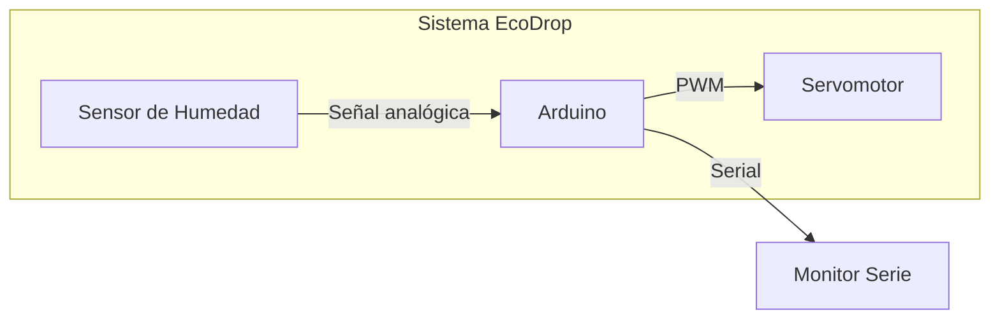
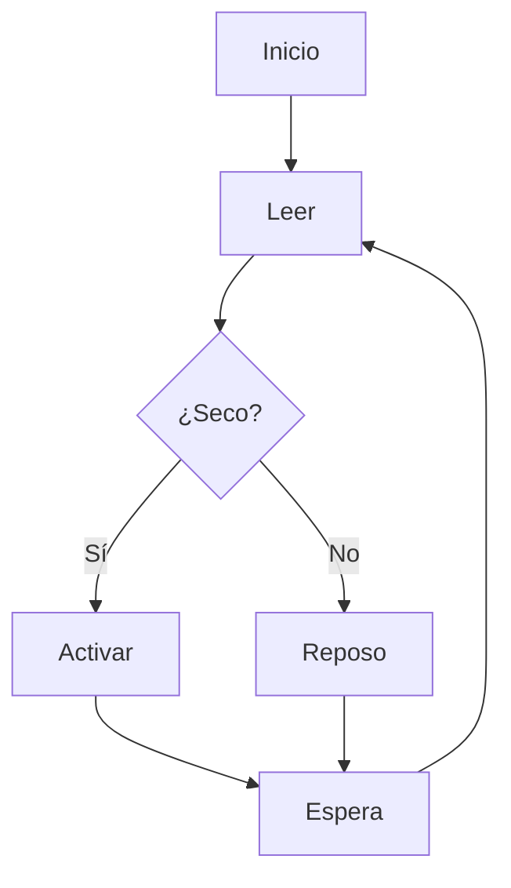
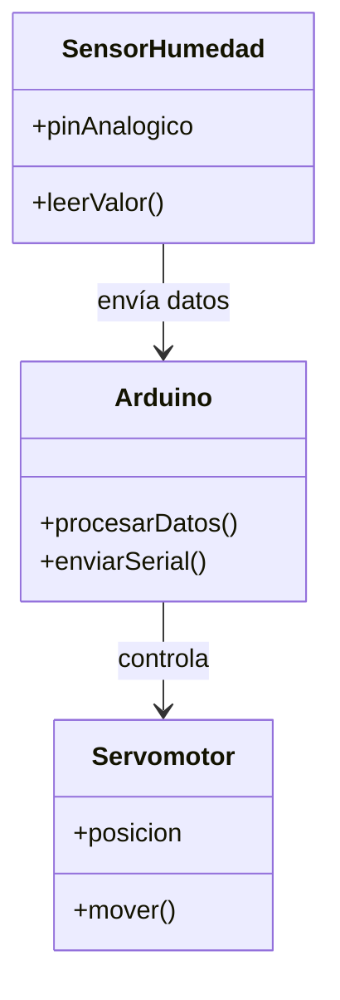
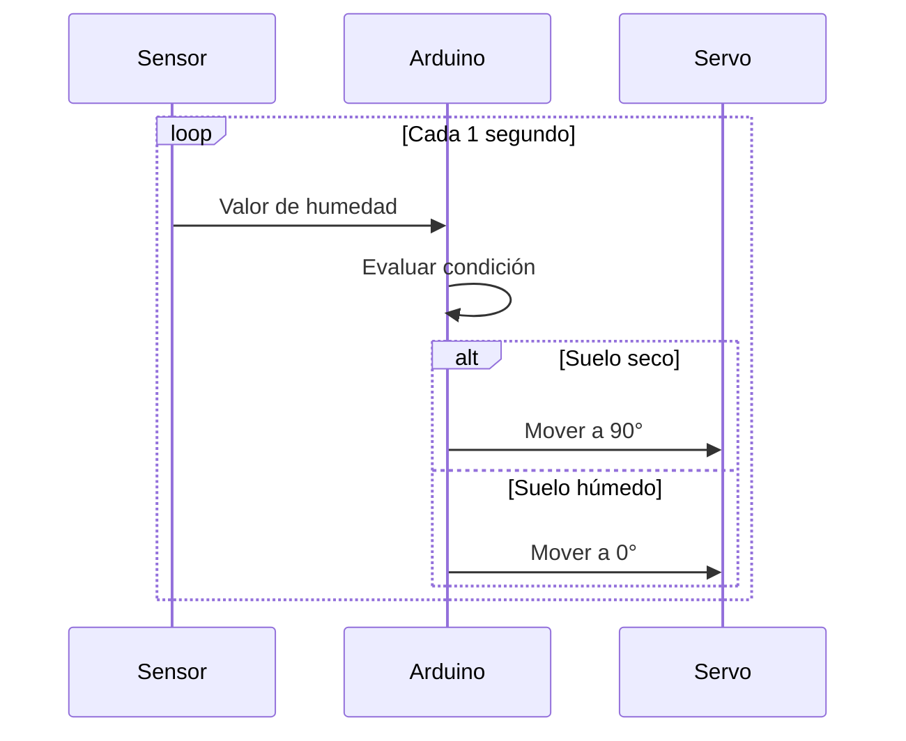
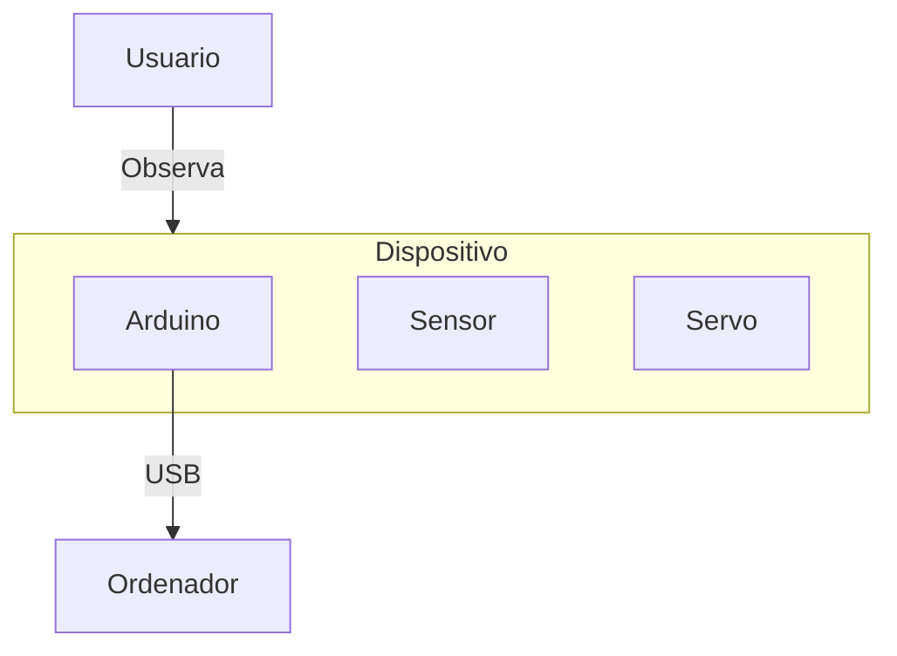

-orange?style=for-the-badge)

  
<div align="center">   
 
# Proyecto tecnológico 

</div>  

```Circuito electrónico (Arduino) + Lógica programable (C++) + Impresión 3D + Integración en proyecto ágil```  

## EcoDrop SMR: Sistema de riego automatizado para plantas basado en Arduino. 

**EcoDrop SMR** es un sistema automatizado que monitoriza la humedad del suelo y activa un mecanismo de riego simulado mediante un servomotor.

Diseñado como proyecto educativo para **1º SMR**, integra:

- Electrónica básica
- Programación en Arduino
- Diseño e impresión 3D
- Metodologías ágiles

### Objetivo
Dispositivo que mide la humedad del suelo y simula el riego mediante un servomotor o LEDs.

### Tecnologías utilizadas
- Arduino
- Sensor de humedad YL-69
- Servomotor SG90
- Diseño 3D (Tinkercad)
- Impresión 3D

### Estructura del proyecto
- `/src` → Código Arduino
- `/docs` → Documentación técnica
- `/stl` → Archivos de impresión 3D
- `/fritzing` → Esquemas electrónicos
- `/images` → Bocetos y capturas

### Funcionamiento
1. El sensor mide la humedad
2. Si el suelo está seco → activa servo
3. Si está húmedo → permanece en reposo

---

# EcoDrop SMR

Sistema automatizado de riego inteligente basado en Arduino para entornos educativos y oficinas.

---

## Descripción

EcoDrop SMR es una solución IoT básica orientada a la monitorización de humedad del suelo y activación automática de riego simulado. El sistema integra hardware, software embebido y diseño físico mediante impresión 3D.

---

## Características

- Monitorización de humedad en tiempo real
- Activación automática mediante servomotor
- Diseño modular y escalable
- Carcasa personalizada mediante impresión 3D
- Bajo coste de implementación

---

## Arquitectura del sistema

### 1 - Diagrama de Arquitectura  



### 2 - Diagrama de FLujo (Lógica del Sistema)  



### Sketch

```cpp

#include <Servo.h>

const int sensorPin = A0;
int valorHumedad = 0;
Servo miServo;

void setup() {
  Serial.begin(9600);
  miServo.attach(9);
  miServo.write(0);
}

void loop() {
  valorHumedad = analogRead(sensorPin);
  Serial.print("Humedad del suelo: ");
  Serial.println(valorHumedad);

  if (valorHumedad > 700) {
    miServo.write(90);
    delay(2000);
  } else {
    miServo.write(0);
  }

  delay(1000);
}

```

### 3 - Diagrama UML de Componentes  




### 4 - Diagrama de Secuencia  


### 5 - Diagrama de Despliegue (Deyploment)  



---  


# EcoDrop SMR  
### Sistema Inteligente de Riego Automatizado

<p align="center">
  
</p>

<p align="center">
  <b>Automatiza el cuidado de tus plantas con tecnología accesible</b><br>
  Proyecto educativo de electrónica, programación y diseño 3D
</p>

---

<p align="center">
  
  
  
  
  
</p>

---

## Descripción

**EcoDrop SMR** es un sistema automatizado que monitoriza la humedad del suelo y activa un mecanismo de riego simulado mediante un servomotor.

Diseñado como proyecto educativo para **1º SMR**, integra:

- Electrónica básica
- Programación en Arduino
- Diseño e impresión 3D
- Metodologías ágiles

---

## Características

- Lectura de humedad en tiempo real  
- Activación automática del sistema de riego  
- Diseño modular y escalable  
- Carcasa personalizada en 3D  
- Bajo coste de implementación  

---

