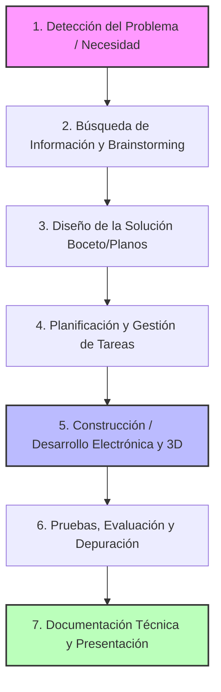
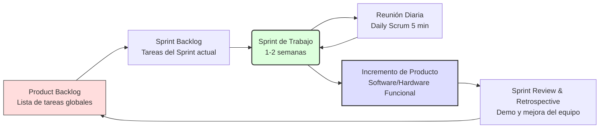

```mermaid
graph TD
    subgraph Enfoque Tradicional Cascada
        A1[Requisitos] --> A2[Diseño completo] --> A3[Construcción total] --> A4[Pruebas finales] --> A5[Entrega final única]
    end

    subgraph Enfoque Ágil Scrum
        B1[Backlog Priorizado] --> B2[Sprint 1: Electrónica] --> B3[Incremento 1: Circuito funcional]
        B3 --> B4[Sprint 2: Carcasa 3D] --> B5[Incremento 2: Caja impresa]
        B5 --> B6[Sprint 3: Integración] --> B7[Producto final EcoDrop SMR]
    end

    style A5 fill:#ffb,stroke:#333
    style B7 fill:#bfb,stroke:#333,stroke-width:2px

```

---

## 1. Etapas de un Proyecto Tecnológico Estándar

Este diagrama de flujo muestra el ciclo de vida lineal que sigue cualquier proyecto tecnológico, adaptado a la metodología de diseño que usamos en el aula.

---

---  

