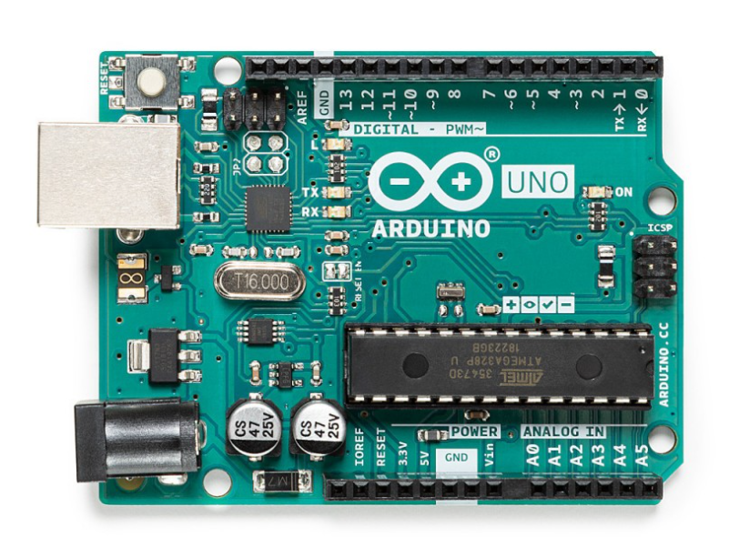

-orange?style=for-the-badge)


<div align="center">   
 
# Anatomía de la placa Arduino UNO  

</div>  

```Descripción detallada de Arduino UNO y sus componentes```  

Las placas Arduino detectan el entorno al recibir información de numerosos sensores e influyen en su entorno controlando luces, motores y otros actuadores.
Arduino es la plataforma de desarrollo de microcontroladores que será la base de tus proyectos.
Construirás los circuitos e interfaces para la interacción y le indicarás al microcontrolador cómo interactuar con otros componentes.


### 1 - Componentes de la placa Arduino UNO  
##  
 


| Nº |  Componente hardware  | Especificaciones técnicas | Descripción | Funciones asociadas |
|----|-----------------------|---------------------------|-------------|---------------------|
| **1** | `Pines digitales (0–13)` | 14 pines I/O digitales (6 con PWM: 3,5,6,9,10,11) | *Permiten configurar cada pin como entrada o salida digital. Los pines PWM (Pulse Width Modulation) generan señal modulada por ancho de pulso (8 bits).* | `pinMode()`, `digitalRead()`, `digitalWrite()`, `analogWrite()` |
| **2** | `LED integrado (Pin 13)` | Conectado internamente al pin digital 13 | *LED integrado para pruebas rápidas y depuración sin hardware externo.* | `digitalWrite(13, HIGH/LOW)` |
| **3** | `LED de encendido (ON)` | Indicador de alimentación | *Se activa cuando la placa recibe energía (USB o Jack DC).* | Indicador visual |
| **4** | `Microcontrolador ATmega328P` | 8 bits (Arquitectura), 16 MHz, 32 KB Flash, 2 KB SRAM, 1 KB EEPROM | *Unidad central de procesamiento que ejecuta el programa (sketch).* | Procesamiento y control del sistema |
| **5** | `Entradas analógicas (A0–A5)` | 6 canales ADC, resolución 10 bits (0–1023) | *Convertidor Analógico-Digital integrado para leer señales entre 0V y 5V.* | `analogRead()` |
| **6** | `Pines de alimentación (5V, 3.3V, GND, VIN)` | 5V regulado, 3.3V máx. 50 mA | *Suministran energía a circuitos externos y sensores.* | Alimentación externa |
| **7** | `Conector de alimentación (Jack DC)` | Entrada recomendada: 7–12V | *Permite alimentar la placa externamente. Incluye regulador de voltaje.* | Alimentación externa |
| **8** | `LED TX y RX` | Indicadores de comunicación serie | *Parpadean durante la transmisión y recepción de datos UART.* | Comunicación Serial |
| **9** | `Puerto USB Tipo B` | Comunicación USB-Serial | *Permite alimentar la placa, cargar programas y comunicación con el PC.* | `Serial.begin()`, `Serial.println()` |
| **10** | `Botón RESET` | Reinicio hardware | *Reinicia el microcontrolador y vuelve a ejecutar el programa desde el inicio.* | Reset manual |


### 2 - Descripción general de los componentes de Arduino UNO  
##   
   

Comenzando en el sentido de las agujas del reloj desde el centro superior:  

| Componente físico | Especificaciones técnicas | Descripción del componente |
|-------------------|---------------------------|----------------------------|
| `Pin de referencia analógica (AREF)` | Referencia ADC | *Define el voltaje de referencia para las entradas analógicas mediante analogReference().* |
| `Tierra digital (GND)` | 0V referencia | *Proporciona referencia de tierra para el sistema digital.* |
| `Pines digitales 2–13` | 12 pines I/O | *Entradas y salidas digitales configurables mediante pinMode(), digitalRead() y digitalWrite().* |
| `Pines 0 (RX) y 1 (TX)` | UART TTL | *Comunicación serie. No deben usarse como I/O digital si se utiliza Serial.* |
| `Botón de reinicio (RESET)` | Reset hardware | *Reinicia el microcontrolador forzando la ejecución desde el inicio.* |
| `Programador ICSP` | SPI programación | *Permite programar el microcontrolador directamente mediante interfaz SPI (Interfaz Periférica Serie) que es un protocolo de comunicación que permite a Arduino intercambiar datos de forma rápida y eficiente con otros dispositivos..* |
| `Entradas analógicas A0–A5` | ADC 10 bits | *Conversión analógico-digital con resolución de 0–1023.* |
| `Pines de alimentación` | 5V, 3.3V, GND, VIN | *Suministro y distribución de energía a la placa y periféricos.* |
| `Entrada alimentación externa (X1)` | 9–12V DC | *Permite alimentar la placa mediante fuente externa.* |
| `Selector alimentación (SV1)` | USB / Externa | *Permite seleccionar la fuente de alimentación activa.* |
| `Puerto USB` | USB-B Serial | *Carga de sketches, comunicación serie y alimentación.* |
| `Microcontrolador ATmega328P` | 8 bits, 16 MHz | *Unidad central que ejecuta el programa cargado en memoria Flash.* |


### 3 - Microcontroladores utilizados en Arduino UNO  
##  

| Nombre del controlador | Especificaciones técnicas | Descripción técnica |
|------------------------|---------------------------|---------------------|
| `ATmega328P` | 32 KB Flash Memory, 2 KB SRAM, 1 KB EEPROM, 14 I/O (6 PWM) | *Microcontrolador principal en versiones recientes del Arduino UNO.* |
| `ATmega168` | 16 KB Flash Memory, 1 KB SRAM, 512 Bytes  EEPROM | *Utilizado en placas Diecimila y primeros Duemilanove.* |
| `ATmega8` | 8 KB Flash Memory, 1 KB SRAM, 512 Bytes EEPROM | *Utilizado en versiones más antiguas del Arduino.* |  

**Nota** *En los tres chips la corriente CC por pin de E/S es 40 mA*  


### 4 - Funcionalidades de los pines digitales  
##  
- Además de las funciones específicas que se indican a continuación, los pines digitales de una placa Arduino pueden utilizarse para **entradas y salidas** de propósito general mediante los comandos ```pinMode()``` , ```digitalRead()``` y ```digitalWrite()```.
- Cada pin tiene una **resistencia pull-up** interna que puede activarse y desactivarse mediante ```digitalWrite()``` (con un valor HIGH o LOW, respectivamente) cuando el pin se configura como entrada.
- La corriente máxima por pin es de **40 mA.**    

| Componente | Especificaciones técnicas | Descripción técnica |
|------------|---------------------------|---------------------|
|`Interrupciones externas (2,3)` | attachInterrupt() | *Permiten generar interrupciones por flanco o cambio de estado.* |
| `PWM (3,5,6,9,10,11)` | 8 bits | *Generación de señal PWM mediante analogWrite().* |
| `SPI (10–13)` | SS, MOSI, MISO, SCK | *Comunicación SPI hardware.* |
| `LED integrado (13)` | LED onboard | *Indicador visual controlado por el pin digital 13.* |


### 5 - Pines analógicos y comunicación  
##  

| Componente | Especificaciones técnicas | Descripción técnica |
|------------|--------------------------|---------------------|
| `ADC 10 bits` | Resolución 0–1023 | *Conversión analógica-digital mediante analogRead().* |
| `I2C (SDA 4, SCL 5)` | TWI hardware | *Comunicación I2C mediante la librería Wire.* |


### 6 - Pines de alimentación  
##  

| Componente | Especificaciones técnicas | Descripción técnica |
|------------|---------------------------|---------------------|
| `VIN` | Entrada no regulada | *Voltaje de entrada cuando se usa fuente externa.* |
| `5V` | Salida regulada | *Alimentación principal del sistema.* |
| `3V3` | 3.3V regulado | *Salida secundaria generada por el chip USB-Serial.* |
| `GND` | Tierra | *Referencia común del sistema.* |

### 7 - Otros pines  
##  

| Componente | Especificaciones técnicas | Descripción técnica |
|------------|---------------------------|---------------------|
| `AREF` | Referencia analógica | *Referencia externa para el ADC.* |
| `RESET` | Reinicio hardware | *Permite reiniciar el microcontrolador externamente.* |

<!--

| Nº | Componente | Especificaciones técnicas | Descripción técnica | Funciones asociadas |
|----|------------|--------------------------|---------------------|---------------------|
| 1 | Pines digitales (0–13) | 14 pines I/O digitales (6 con PWM: 3,5,6,9,10,11) | Permiten configurar cada pin como entrada o salida digital. Los pines PWM generan señal modulada por ancho de pulso (8 bits). | `pinMode()`, `digitalRead()`, `digitalWrite()`, `analogWrite()` |
| 2 | LED integrado (Pin 13) | Conectado internamente al pin digital 13 | LED integrado para pruebas rápidas y depuración sin hardware externo. | Control mediante `digitalWrite(13, HIGH/LOW)` |
| 3 | LED de encendido (ON) | Indicador de alimentación | Se activa cuando la placa recibe energía (USB o Jack DC). | Indicador visual |
| 4 | Microcontrolador ATmega328P | 8 bits, 16 MHz, 32 KB Flash, 2 KB SRAM, 1 KB EEPROM | Unidad central de procesamiento que ejecuta el programa (sketch). | Procesamiento y control del sistema |
| 5 | Entradas analógicas (A0–A5) | 6 canales ADC, resolución 10 bits (0–1023) | Convertidor Analógico-Digital integrado para leer señales entre 0V y 5V. | `analogRead()` |
| 6 | Pines de alimentación (5V, 3.3V, GND, VIN) | 5V regulado, 3.3V máx. 50 mA | Suministran energía a circuitos externos y sensores. | Alimentación externa |
| 7 | Conector de alimentación (Jack DC) | Entrada recomendada: 7–12V | Permite alimentar la placa externamente. Incluye regulador de voltaje. | Alimentación externa |
| 8 | LED TX y RX | Indicadores de comunicación serie | Parpadean durante la transmisión y recepción de datos UART. | Comunicación Serial |
| 9 | Puerto USB Tipo B | Comunicación USB-Serial | Permite alimentar la placa, cargar programas y comunicación con el PC. | `Serial.begin()`, `Serial.println()` |
| 10 | Botón RESET | Reinicio hardware | Reinicia el microcontrolador y vuelve a ejecutar el programa desde el inicio. | Reset manual |


## Partes de la placa

### 1. Pines digitales
Utilice estos pines con `digitalRead()`, `digitalWrite()` y `analogWrite()`.  
`analogWrite()` solo funciona en los pines con el símbolo **PWM**.

### 2. LED del pin 13
El único actuador integrado en la placa. Además de ser un objetivo práctico para tu primer boceto de parpadeo, este LED es muy útil para la depuración.

### 3. LED de encendido
Indica que tu Arduino recibe alimentación. Útil para la depuración.

### 4. Microcontrolador ATmega
El corazón de tu placa.

### 5. Entradas analógicas
Utilice estos pines con `analogRead()`.

### 6. Pines GND y 5V
Utilice estos pines para proporcionar alimentación de **+5 V** y tierra a sus circuitos.

### 7. Conector de alimentación
Así se alimenta el Arduino cuando no está conectado a un puerto USB.  
Acepta voltajes de entre **7 y 12 V**.

### 8. LED TX y RX
Estos LED indican la comunicación entre Arduino y el ordenador.  
Parpadean rápidamente durante la carga del boceto y la comunicación serie.  
Son útiles para la depuración.

### 9. Puerto USB
Se utiliza para alimentar su Arduino UNO, cargar sus bocetos a su Arduino y para comunicarse con su boceto de Arduino (a través de `Serial.println()`, etc.).

### 10. Botón de reinicio
Reinicia el microcontrolador ATmega.-->  

---
