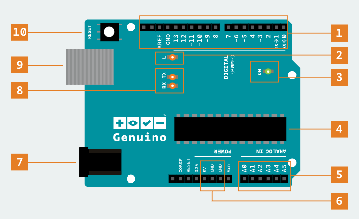

# Anatomía de la placa Arduino UNO

```Una descripción general del clásico Arduino UNO```  

- Las placas Arduino detectan el entorno al recibir información de numerosos sensores e influyen en su entorno controlando luces, motores y otros actuadores.
- Las placas Arduino son la plataforma de desarrollo de microcontroladores que será la base de tus proyectos.
- Construirás los circuitos e interfaces para la interacción y le indicarás al microcontrolador cómo interactuar con otros componentes.

##  

### 1 - Componentes de la placa Arduino UNO  
   

| Nº | Componente | Especificaciones técnicas | Descripción técnica | Funciones asociadas |
|----|------------|--------------------------|---------------------|---------------------|
| 1 | Pines digitales (0–13) | 14 pines I/O digitales (6 con PWM: 3,5,6,9,10,11) | Permiten configurar cada pin como entrada o salida digital. Los pines PWM generan señal modulada por ancho de pulso (8 bits). | `pinMode()`, `digitalRead()`, `digitalWrite()`, `analogWrite()` |
| 2 | LED integrado (Pin 13) | Conectado internamente al pin digital 13 | LED integrado para pruebas rápidas y depuración sin hardware externo. | Control mediante `digitalWrite(13, HIGH/LOW)` |
| 3 | LED de encendido (ON) | Indicador de alimentación | Se activa cuando la placa recibe energía (USB o Jack DC). | Indicador visual |
| 4 | Microcontrolador ATmega328P | 8 bits, 16 MHz, 32 KB Flash, 2 KB SRAM, 1 KB EEPROM | Unidad central de procesamiento que ejecuta el programa (sketch). | Procesamiento y control del sistema |
| 5 | Entradas analógicas (A0–A5) | 6 canales ADC, resolución 10 bits (0–1023) | Convertidor Analógico-Digital integrado para leer señales entre 0V y 5V. | `analogRead()` |
| 6 | Pines de alimentación (5V, 3.3V, GND, VIN) | 5V regulado, 3.3V máx. 50 mA | Suministran energía a circuitos externos y sensores. | Alimentación externa |
| 7 | Conector de alimentación (Jack DC) | Entrada recomendada: 7–12V | Permite alimentar la placa externamente. Incluye regulador de voltaje. | Alimentación externa |
| 8 | LED TX y RX | Indicadores de comunicación serie | Parpadean durante la transmisión y recepción de datos UART. | Comunicación Serial |
| 9 | Puerto USB Tipo B | Comunicación USB-Serial | Permite alimentar la placa, cargar programas y comunicación con el PC. | `Serial.begin()`, `Serial.println()` |
| 10 | Botón RESET | Reinicio hardware | Reinicia el microcontrolador y vuelve a ejecutar el programa desde el inicio. | Reset manual |


## 🔎 Partes de la placa

### 1. Pines digitales
Utilice estos pines con `digitalRead()`, `digitalWrite()` y `analogWrite()`.  
`analogWrite()` solo funciona en los pines con el símbolo **PWM**.

### 2. LED del pin 13
El único actuador integrado en la placa. Además de ser un objetivo práctico para tu primer boceto de parpadeo, este LED es muy útil para la depuración.

### 3. LED de encendido
Indica que tu Arduino recibe alimentación. Útil para la depuración.

### 4. Microcontrolador ATmega
El corazón de tu placa.

### 5. Entradas analógicas
Utilice estos pines con `analogRead()`.

### 6. Pines GND y 5V
Utilice estos pines para proporcionar alimentación de **+5 V** y tierra a sus circuitos.

### 7. Conector de alimentación
Así se alimenta el Arduino cuando no está conectado a un puerto USB.  
Acepta voltajes de entre **7 y 12 V**.

### 8. LED TX y RX
Estos LED indican la comunicación entre Arduino y el ordenador.  
Parpadean rápidamente durante la carga del boceto y la comunicación serie.  
Son útiles para la depuración.

### 9. Puerto USB
Se utiliza para alimentar su Arduino UNO, cargar sus bocetos a su Arduino y para comunicarse con su boceto de Arduino (a través de `Serial.println()`, etc.).

### 10. Botón de reinicio
Reinicia el microcontrolador ATmega.

---
