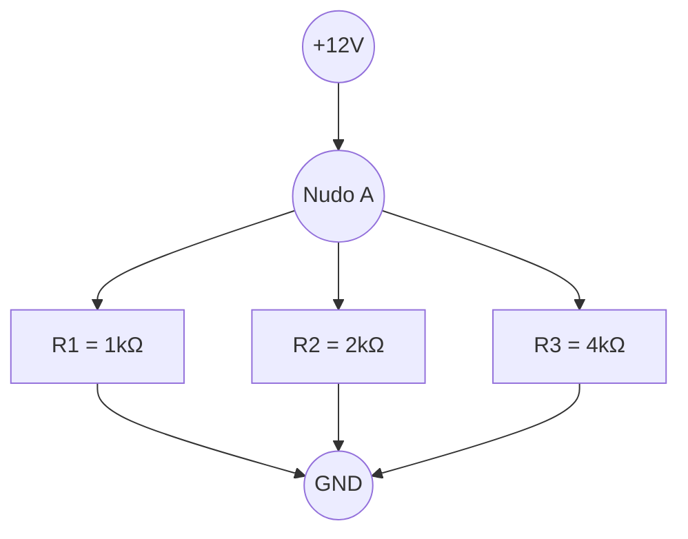
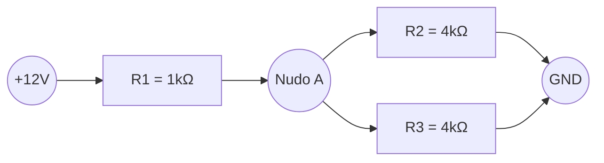

# Módulo CM0313 Robótica (1º SMR)

## Diseño, análisis y medición de circuitos de CC 

**Profesor:** Ezequiel Llarena Borges

---

## 1. Objetivos

- Diseñar y montar tres circuitos de corriente continua con resistencias: **serie**, **paralelo** y **mixto**.
- Calcular teóricamente las tensiones, intensidades y resistencia equivalente de cada circuito.
- Medir con el multímetro las magnitudes reales del circuito montado.
- Comprobar experimentalmente la **ley de Ohm** (V = I·R) en cada elemento del circuito.
- Comprobar experimentalmente las **leyes de Kirchhoff**: la ley de tensiones (LKV) en el circuito serie y la ley de corrientes (LKC) en el circuito paralelo y en el mixto.
- Comparar los valores calculados con los medidos, identificando y justificando las posibles desviaciones.

## 2. Resultado de aprendizaje relacionado

El alumno analiza y verifica circuitos eléctricos de corriente continua, aplicando la ley de Ohm y las leyes de Kirchhoff, y realiza el montaje y la medición de las magnitudes eléctricas del circuito con los instrumentos adecuados.

## 3. Fundamento teórico (resumen)

| Ley | Enunciado aplicado |
|---|---|
| **Ley de Ohm** | En cada resistencia: V = I · R |
| **1ª Ley de Kirchhoff (LKC — corrientes)** | La suma de las corrientes que entran en un nudo es igual a la suma de las que salen |
| **2ª Ley de Kirchhoff (LKV — tensiones)** | La suma de las caídas de tensión en un lazo cerrado es igual a la tensión aplicada |

## 4. Material necesario

- Fuente de alimentación de CC regulable (o pila/batería de valor conocido).
- Protoboard.
- Resistencias: 1 kΩ, 2 kΩ, 3 kΩ y 4 kΩ (dos unidades de 4 kΩ, o combinación equivalente).
- Cables de conexión (puentes).
- Multímetro digital (función voltímetro, amperímetro y óhmetro).
- Calculadora.
- Esta hoja de guión y la hoja de respuestas/informe.

## 5. Desarrollo de la práctica

Para los tres circuitos se utiliza una tensión de alimentación de **Vcc = 12 V**.

### Circuito 1 — Circuito serie

Tres resistencias en serie: R1 = 1 kΩ, R2 = 2 kΩ, R3 = 3 kΩ.

**Pasos:**
1. Calcular la resistencia equivalente (Req = R1+R2+R3) y la intensidad total (I = Vcc / Req).
2. Calcular la caída de tensión en cada resistencia (V = I·R).
3. Montar el circuito en la protoboard.
4. Medir con el multímetro la intensidad total y la tensión en cada resistencia.
5. Comprobar que la suma de las tres tensiones medidas coincide con los 12 V de la fuente (LKV).

### Circuito 2 — Circuito paralelo

Tres resistencias en paralelo: R1 = 1 kΩ, R2 = 2 kΩ, R3 = 4 kΩ.

**Pasos:**
1. Calcular la resistencia equivalente del paralelo y la intensidad por cada rama (I = Vcc / R, ya que los tres reciben los 12 V).
2. Calcular la intensidad total entregada por la fuente (suma de las tres ramas).
3. Montar el circuito en la protoboard.
4. Medir con el multímetro la tensión en cada rama (debe ser igual a Vcc) y la intensidad de cada rama.
5. Comprobar que la suma de las intensidades medidas en las tres ramas coincide con la intensidad total entregada por la fuente (LKC).

### Circuito 3 — Circuito mixto

R1 = 1 kΩ en serie con el paralelo de R2 = 4 kΩ y R3 = 4 kΩ.

**Pasos:**
1. Calcular la resistencia equivalente del bloque paralelo (R2 y R3), y sumarla a R1 para obtener la Req total.
2. Calcular la intensidad total (I = Vcc / Req).
3. Calcular la tensión en R1 y la tensión en el bloque paralelo (V = I·R).
4. Calcular la intensidad por R2 y por R3.
5. Montar el circuito en la protoboard.
6. Medir con el multímetro la intensidad total, la tensión en R1, la tensión del bloque paralelo, y la intensidad por R2 y R3.
7. Comprobar que la intensidad total medida coincide con la suma de las intensidades de R2 y R3 (LKC), y que la tensión de R1 más la tensión del paralelo coincide con los 12 V de la fuente (LKV).

---

## 6. Hoja de respuestas / informe del alumno

**Nombre y apellidos:** ______________________________ **Grupo:** __________ **Fecha:** __________

### Circuito 1 — Serie

| Magnitud | Valor calculado | Valor medido | Desviación (%) |
|---|---|---|---|
| Req |  |  |  |
| I total |  |  |  |
| V en R1 |  |  |  |
| V en R2 |  |  |  |
| V en R3 |  |  |  |

¿Se cumple la ley de Kirchhoff de tensiones (V1+V2+V3 = Vcc)? ___________________________________

### Circuito 2 — Paralelo

| Magnitud | Valor calculado | Valor medido | Desviación (%) |
|---|---|---|---|
| Req |  |  |  |
| I en R1 |  |  |  |
| I en R2 |  |  |  |
| I en R3 |  |  |  |
| I total |  |  |  |

¿Se cumple la ley de Kirchhoff de corrientes (I1+I2+I3 = I total)? ___________________________________

### Circuito 3 — Mixto

| Magnitud | Valor calculado | Valor medido | Desviación (%) |
|---|---|---|---|
| Req total |  |  |  |
| I total |  |  |  |
| V en R1 |  |  |  |
| V en el bloque paralelo |  |  |  |
| I en R2 |  |  |  |
| I en R3 |  |  |  |

¿Se cumplen ambas leyes de Kirchhoff en este circuito? ___________________________________

### Incidencias durante la práctica

_(Averías, valores fuera de lo esperado, dificultades de montaje, dudas surgidas, etc.)_

_____________________________________________________________________________
_____________________________________________________________________________
_____________________________________________________________________________

### Conclusiones

_(¿Se confirma la ley de Ohm y las leyes de Kirchhoff? ¿A qué se deben las posibles diferencias entre los valores calculados y los medidos?)_

_____________________________________________________________________________
_____________________________________________________________________________
_____________________________________________________________________________

---

*Ezequiel Llarena Borges — Módulo CM0313 Robótica · 1º SMR*
