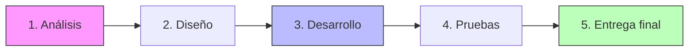
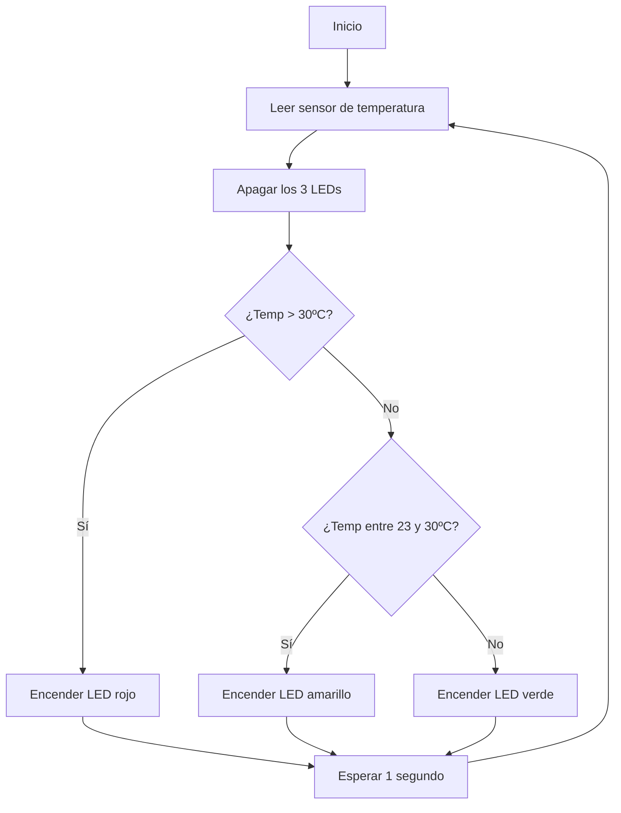
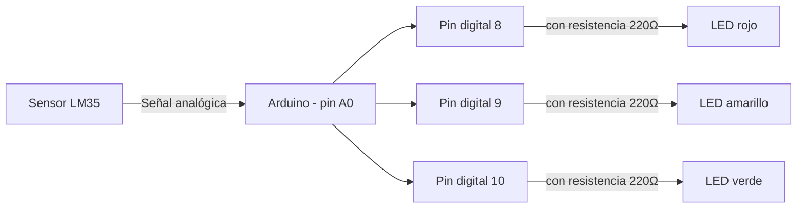

# Guión del Proyecto Tecnológico

**Módulo:** Informática aplicada a sistemas electrónicos (Robótica) · 1º SMR  
**Profesor:** Ezequiel Llarena Borges

---

## Enunciado del proyecto

Desarrolla un proyecto para la creación de un prototipo de un sistema robótico funcional, respetando las fases de diseño del proceso tecnológico, elaborando la documentación técnica correspondiente y presentando dicho proyecto ante la clase.

---

## Fases del proyecto tecnológico


<p align="center"><em>Fases del proyecto tecnológico</em></p>

| Fase | Qué se hace |
|---|---|
| **1. Análisis** | Definir el problema, los requisitos y los recursos necesarios |
| **2. Diseño** | Bocetar la solución: circuito, diagrama de flujo, componentes |
| **3. Desarrollo** | Montar el circuito y programar el microcontrolador |
| **4. Pruebas** | Validar que el sistema cumple los requisitos, con datos medidos |
| **5. Entrega final** | Documentar el proyecto y presentarlo terminado |

Estas 5 fases se reparten en **3 trimestres**, con **una entrega por trimestre**.

---

## Distribución de las fases por trimestre

### 🔹 Trimestre 1: Entrega 1

**Fases implicadas:** 1. Análisis · 2. Diseño

**Entregables:**
- Requisitos del sistema (qué debe hacer el proyecto y en qué condiciones).
- Recursos necesarios: componentes electrónicos y microcontroladora (Arduino Uno).
- Diseño del circuito en Tinkercad (esquema de conexiones y simulación).
- Diagrama de flujo de la lógica que seguirá el programa.

**Herramientas:**
- Tinkercad → diseño y simulación del circuito.
- Draw.io / papel → diagrama de flujo.
- Documento de texto (Word/Markdown) → redacción de requisitos.

---

### 🔹 Trimestre 2: Entrega 2

**Fases implicadas:** 3. Desarrollo

**Entregables:**
- Circuito montado físicamente (protoboard) con todos los componentes conectados.
- Sketch de Arduino programado, cargado y funcionando.
- Registro del montaje (fotos o capturas + incidencias encontradas).

**Herramientas:**
- Arduino IDE → programación y carga del sketch.
- Protoboard, cables jumper y componentes físicos.
- Cable USB → conexión Arduino–ordenador.

---

### 🔹 Trimestre 3: Entrega 3 (Final)

**Fases implicadas:** 4. Pruebas · 5. Entrega final

**Entregables:**
- Documento de pruebas: parámetros medidos, criterios de validación y resultados obtenidos.
- Memoria técnica final del proyecto.
- Presentación del proyecto terminado ante la clase.

**Herramientas:**
- Monitor serie del Arduino IDE → observar los valores en tiempo real durante las pruebas.
- Editor de documentación (Word/Markdown) → memoria técnica.
- Herramienta de presentación (PowerPoint o similar).

---

## Ejemplo completo: Semáforo de temperatura con Arduino Uno

**Objetivo del proyecto:** medir continuamente la temperatura de una habitación con un sensor y encender uno de tres LEDs según el rango: 🔴 rojo si supera 30 ºC, 🟡 amarillo si está entre 23 ºC y 30 ºC, 🟢 verde si es inferior a 23 ºC.

### Fase 1: Análisis  
---  

**Requisitos funcionales:**
- El sistema debe leer la temperatura de forma continua (no una sola vez).
- Debe encender un único LED según el rango de temperatura detectado.
- Los rangos son: > 30 ºC → rojo · 23-30 ºC → amarillo · < 23 ºC → verde.

**Requisitos no funcionales:**
- Bajo coste, fácil montaje en un aula.
- Respuesta prácticamente inmediata a los cambios de temperatura.

**Componentes y recursos necesarios:**

| Componente | Cantidad | Función |
|---|---|---|
| Arduino Uno | 1 | Microcontrolador que lee el sensor y controla los LEDs |
| Sensor de temperatura analógico (LM35) | 1 | Mide la temperatura ambiente |
| LED rojo | 1 | Indica temperatura > 30 ºC |
| LED amarillo | 1 | Indica temperatura entre 23-30 ºC |
| LED verde | 1 | Indica temperatura < 23 ºC |
| Resistencia 220 Ω | 3 | Protege cada LED de corriente excesiva |
| Protoboard | 1 | Montaje del circuito |
| Cables jumper | Varios | Conexiones entre componentes |

### Fase 2: Diseño  
---  

**Diagrama de flujo de la lógica:**



**Diseño del circuito (a modelar en Tinkercad):**



- Sensor LM35: pin de señal a **A0**, alimentación a 5V y GND.
- LED rojo: ánodo al pin digital **8** a través de una resistencia de 220 Ω; cátodo a GND.
- LED amarillo: ánodo al pin digital **9** a través de una resistencia de 220 Ω; cátodo a GND.
- LED verde: ánodo al pin digital **10** a través de una resistencia de 220 Ω; cátodo a GND.

### Fase 3: Desarrollo  
---  

**Montaje:** conectar el sensor y los tres LEDs según el diseño anterior sobre la protoboard, y cargar el siguiente sketch en el Arduino Uno.

```cpp
// Semáforo de temperatura - Arduino Uno
// Sensor de temperatura analógico (LM35) conectado en A0
// LED rojo -> pin 8 · LED amarillo -> pin 9 · LED verde -> pin 10

const int pinSensor = A0;
const int pinLedRojo = 8;
const int pinLedAmarillo = 9;
const int pinLedVerde = 10;

void setup() {
  pinMode(pinLedRojo, OUTPUT);
  pinMode(pinLedAmarillo, OUTPUT);
  pinMode(pinLedVerde, OUTPUT);
  Serial.begin(9600);
}

void loop() {
  // Lectura del sensor y conversión a grados Celsius
  int lectura = analogRead(pinSensor);
  float voltaje = lectura * (5.0 / 1023.0);
  float temperatura = voltaje * 100.0; // LM35: 10 mV por cada ºC

  Serial.print("Temperatura: ");
  Serial.print(temperatura);
  Serial.println(" ºC");

  // Apagar los tres LEDs antes de decidir cuál encender
  digitalWrite(pinLedRojo, LOW);
  digitalWrite(pinLedAmarillo, LOW);
  digitalWrite(pinLedVerde, LOW);

  // Lógica de decisión según el rango de temperatura
  if (temperatura > 30.0) {
    digitalWrite(pinLedRojo, HIGH);
  } else if (temperatura >= 23.0) {
    digitalWrite(pinLedAmarillo, HIGH);
  } else {
    digitalWrite(pinLedVerde, HIGH);
  }

  delay(1000); // Nueva lectura cada segundo
}
```

### Fase 4: Pruebas  
---  

**Documento de pruebas — parámetros, criterios de validación y resultados:**

| Nº | Procedimiento de prueba | Temperatura esperada | Criterio de validación | Resultado obtenido | ¿Validado? |
|---|---|---|---|---|---|
| 1 | Acercar el sensor a un ambiente frío (nevera, hielo) | < 23 ºC | Se enciende solo el LED verde | *(a rellenar por el alumno)* | ☐ |
| 2 | Dejar el sensor a temperatura ambiente normal | Entre 23 y 30 ºC | Se enciende solo el LED amarillo | *(a rellenar por el alumno)* | ☐ |
| 3 | Acercar el sensor a una fuente de calor (secador, mano) | > 30 ºC | Se enciende solo el LED rojo | *(a rellenar por el alumno)* | ☐ |
| 4 | Comprobar el monitor serie mientras cambia la temperatura | Coherente con el LED encendido | El valor mostrado coincide con el LED activo | *(a rellenar por el alumno)* | ☐ |
| 5 | Dejar el sistema en marcha varios minutos | Lectura continua | El sistema no se bloquea ni dejar de leer | *(a rellenar por el alumno)* | ☐ |

> El alumno debe repetir cada prueba, anotar la temperatura real observada en el monitor serie y marcar si el resultado obtenido coincide con el criterio de validación.

### Fase 5: Entrega final  
---  

**Qué debe incluir la entrega final de este ejemplo:**
- Circuito montado y funcionando (o simulación en Tinkercad si no hay componentes físicos disponibles).
- Sketch final comentado, igual al mostrado en la Fase 3.
- Documento de pruebas de la Fase 4 completado con resultados reales.
- Breve memoria técnica: objetivo, componentes usados, esquema del circuito y conclusiones.
- Presentación/demostración en clase del semáforo de temperatura funcionando.

---

*Profesor: Ezequiel Llarena Borges · Informática aplicada a sistemas electrónicos (Robótica) · 1º SMR*
