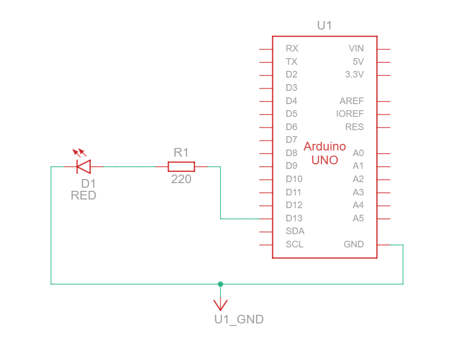
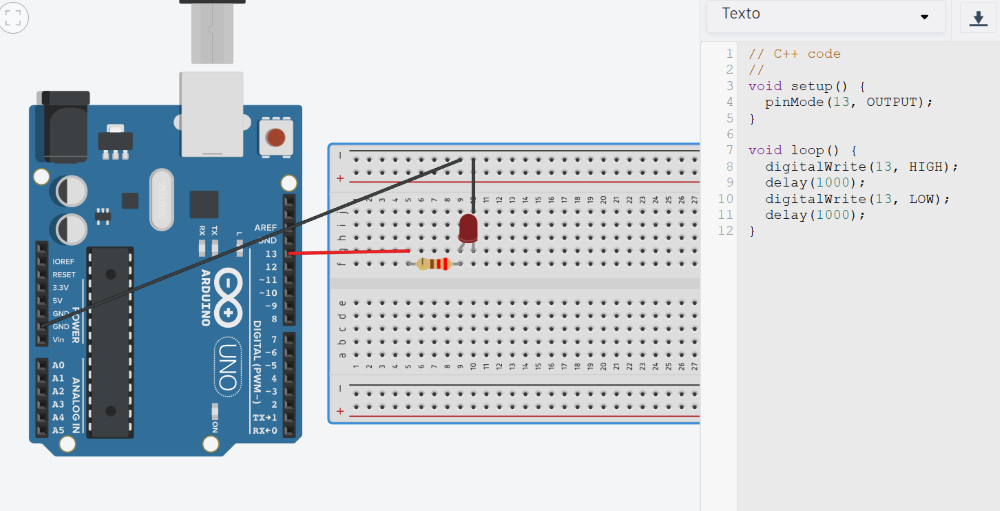

-brown?style=for-the-badge)

  

# Práctica 3: Control de un LED mediante pin digital (Arduino UNO)

---  
<!-- NOTA: ver este documento (https://docs.google.com/document/d/1jvlvm2FqSEJCLl_ezwGhrs87LphTGowsda3Qb6LG9Rk/edit?tab=t.0)  -->


## 1. Conceptos previos

Antes de conectar nada, debemos entender qué papel juega cada pieza en el circuito:

### A. Componentes Pasivos
Son componentes que **no introducen energía** neta en el circuito ni pueden controlar la electricidad por sí mismos. Solo la consumen, la resisten o la almacenan.
* **La Resistencia:** Su función es limitar el flujo de corriente. Es vital porque protege a los componentes más sensibles de quemarse.
* **Dato técnico:** Se miden en Ohmios ($\Omega$). No tienen polaridad (puedes ponerlas en cualquier sentido).

### B. Componentes Activos
Son aquellos que pueden **controlar el flujo eléctrico** o modificar la señal. Requieren una fuente de alimentación externa para realizar su función.
* **El LED (Diodo Emisor de Luz):** Es un semiconductor que emite luz cuando pasa corriente a través de él. 
* **Dato técnico:** ¡Tienen polaridad! La pata larga (Ánodo) es el positivo y la pata corta (Cátodo) es el negativo.

---

## 2. Proyecto: Control de Salida Digital

**Objetivo:** Montar un circuito donde una placa Arduino (cerebro) controle un componente activo (LED) protegido por un componente pasivo (resistencia).

### Materiales
* 1 Arduino Uno + Cable USB
* 1 Protoboard
* 1 LED (Activo)
* 1 Resistencia de $220\Omega$ (Pasivo) - Colores: Rojo-Rojo-Marrón
* 2 Cables Jumper (Macho-Macho)

### Paso 1: Instrucciones de montaje (Hardware)
1.  **Pin 13:** Conecta un cable desde el Pin 13 de tu Arduino hasta una fila libre de la protoboard.
2.  **Resistencia:** Conecta un extremo de la resistencia en la misma fila donde pusiste el cable anterior.
3.  **LED:** Conecta la pata larga (**Ánodo**) en la misma fila donde termina la resistencia. La pata corta (**Cátodo**) ponla en una fila diferente.
4.  **GND:** Conecta un cable desde el pin **GND** del Arduino hasta la fila de la pata corta del LED.
5.  **Esquema del montaje:**  
     

> **Nota de seguridad:** Nunca conectes el LED directamente al Arduino sin la resistencia; el componente activo se quemaría por exceso de corriente.

### Paso 2: Programación (Software)
Copia este código en el IDE de Arduino y cárgalo a la placa:

```cpp
/*
  SMR1 - Práctica 1: Activos y Pasivos
  Control de un LED mediante Pin Digital
*/

int pinActivo = 13; // Definimos el pin del LED

void setup() {
  pinMode(pinActivo, OUTPUT); // Configuramos el pin como SALIDA
}

void loop() {
  digitalWrite(pinActivo, HIGH); // Encendemos (Enviamos 5V)
  delay(1000);                   // Esperamos 1 segundo
  digitalWrite(pinActivo, LOW);  // Apagamos (Enviamos 0V)
  delay(1000);                   // Esperamos 1 segundo
}

```

 #### Diseño y simulación con Arduino en Tinkercad  
 
   


## 3. Checklist de tareas

| Tarea | Objetivo | Verificado |
| :--- | :--- | :---: |
| **Identificación de componentes** | Distinguir visualmente la resistencia (pasivo) del LED (activo). | ☐ |
| **Montaje de circuito** | El LED y la resistencia están en serie y el LED tiene la polaridad correcta. | ☐ |
| **Modificación de código** | Cambiar los valores del `delay` a `200` y observar el parpadeo rápido. | ☐ |
| **Seguridad eléctrica** | El circuito nunca se conecta a la placa sin la resistencia limitadora. | ☐ |

---

### 4. Cuestionario de consolidación
Responde brevemente a las siguientes preguntas para validar los conceptos aprendidos en esta práctica:

1. Si cambiamos la resistencia de $220\Omega$ por una de $10k\Omega$ ($10.000\Omega$), **¿qué crees que le pasará a la intensidad de la luz del LED? ¿Por qué?**

2. El LED es un componente semiconductor. **Explica con tus palabras qué sucede si intentas que la corriente pase del Cátodo (negativo) al Ánodo (positivo).**

3. En la lógica de programación o código _(sketch)_ de Arduino, **¿qué función realiza el comando `digitalWrite(pin, LOW)` y qué efecto tiene sobre el flujo de electrones hacia el LED?**

4. Análisis de fallos: **Si el código se carga correctamente pero el LED no enciende, indica los 3 puntos de fallo más comunes que revisarías (Hardware).**

---

### 5. Reto opcional (Para subir nota)
Modifica el circuito y el código para añadir un segundo LED (otro componente activo). 
* El **LED 1** debe encenderse mientras el **LED 2** está apagado, y viceversa (efecto policía).
* ¿Has necesitado añadir otra resistencia? Justifica por qué.

<!--
# Guía de Soluciones: Práctica de Elementos Activos y Pasivos

Este documento sirve como hoja de corrección para el profesor sobre los ejercicios y el cuestionario de la práctica.

---

### A. Soluciones al Cuestionario de Consolidación

**1. Si cambiamos la resistencia de $220\Omega$ por una de $10k\Omega$, ¿qué pasará?**
* **Respuesta:** La luz del LED se volverá muy tenue o incluso imperceptible.
* **Explicación:** Según la Ley de Ohm ($I = V / R$), al aumentar drásticamente la resistencia (el denominador), la intensidad de la corriente ($I$) disminuye. Menos electrones pasando por segundo por el componente activo equivalen a menos luz.

**2. ¿Qué sucede si la corriente intenta pasar del Cátodo al Ánodo?**
* **Respuesta:** El LED no se encenderá.
* **Explicación:** Al ser un componente activo semiconductor (diodo), solo permite el paso de corriente en un sentido. En polarización inversa, el componente actúa como un interruptor abierto (resistencia infinita).

**3. ¿Qué hace `digitalWrite(pin, LOW)`?**
* **Respuesta:** Pone el voltaje del pin a $0V$ (GND).
* **Explicación:** Al no haber diferencia de potencial (voltaje) entre los dos extremos del circuito del LED, el flujo de electrones se detiene completamente.

**4. Análisis de fallos (3 puntos comunes):**
1.  **Polaridad:** El LED está conectado al revés.
2.  **Mala conexión:** Los componentes no están en la misma fila de la protoboard (falta de continuidad).
3.  **Pin incorrecto:** El cable está en un pin distinto al definido en el código (ej. está en el 12 en vez del 13).

---

### B. Solución al Reto Extra (Efecto Policía)

Para este reto, el alumno debe comprender que cada componente activo (LED) necesita su propio componente pasivo (resistencia) para estar protegido de forma independiente.

**Esquema lógico:**
* LED 1 en Pin 13 + Resistencia.
* LED 2 en Pin 12 + Resistencia.


**Código corregido:**
```cpp
int led1 = 13;
int led2 = 12;

void setup() {
  pinMode(led1, OUTPUT);
  pinMode(led2, OUTPUT);
}

void loop() {
  digitalWrite(led1, HIGH); 
  digitalWrite(led2, LOW);
  delay(200);
  
  digitalWrite(led1, LOW);
  digitalWrite(led2, HIGH);
  delay(200);
}

-->
