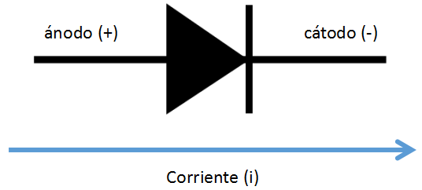
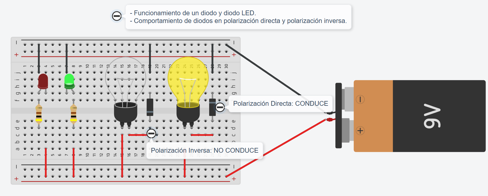

# Práctica 2: Diodo y polarización
**Módulo:** Robótica   
**Profesor:** Ezequiel Llarena Borges

---

## 1. Conceptos clave
El **diodo** es un componente electrónico **semiconductor** que solo permite el paso de la corriente eléctrica en un sentido.
* **Polarización Directa:** La corriente fluye (el diodo actúa como un cable).
* **Polarización Inversa:** La corriente se bloquea (el diodo actúa como un aislante).
  ----  
     
* **Diodo LED:** Un diodo que emite luz al ser atravesado por electrones. Siempre requiere una **resistencia limitadora** para no quemarse.

---

## 2. Herramientas necesarias
Componentes de Tinkercad:
* [ ] 1 Batería de **9V**.
* [ ] 1 Protoboard (Placa de pruebas pequeña).
* [ ] 2 Bombillas.
* [ ] 2 Diodos rectificadores.
* [ ] 1 LED Rojo y 1 LED Verde.
* [ ] 2 Resistencias de **400 Ω** (Colores: Amarillo-Violeta-Marrón).

---

## 3. Configuración de los circuitos

Deberás montar los 4 ejemplos en la misma protoboard de forma organizada.

### 3.1. Diodos Rectificadores y Bombillas

#### Circuito 1: Polarización Directa
- **Conexión:** Ánodo (lado sin franja) al positivo -> Cátodo (lado con franja) a terminal de bombilla -> Segundo terminal de bombilla al negativo.
- **Objetivo:** Observar el paso de corriente.   
#### Circuito 2: Polarización Inversa
- **Conexión:** Invierte el diodo del Circuito 1 (Cátodo al positivo).
- **Objetivo:** Observar el bloqueo de corriente.

---

### 3.2. Diodos LED y Resistencias

#### Circuito 3: LED Verde (Polarización Directa)
- **Conexión:** Positivo -> Resistencia 400 Ω -> Ánodo LED (pata larga) -> Cátodo LED (pata corta) -> Negativo.
- **Aviso:** El LED verde debe encenderse correctamente.

#### Circuito 4: LED Rojo (Polarización Inversa)
- **Conexión:** Positivo -> Resistencia 400 Ω -> Cátodo LED (pata corta) -> Ánodo LED (pata larga) -> Negativo.
- **Aviso:** El LED rojo permanecerá apagado.

---  

### 3.3. Diseño y simulación en Tinkercad  

## 4. Tabla de comprobación
Completa esta tabla tras realizar la simulación:

| Circuito | Componente | Polarización | Estado (Encendido/Apagado) | Voltaje en LED/Bombilla |
| :--- | :--- | :--- | :--- | :--- |
| **1** | Bombilla | Directa | | |
| **2** | Bombilla | Inversa | | |
| **3** | LED Verde | Directa | | |
| **4** | LED Rojo | Inversa | | |

---

## 5. Cuestionario de reflexión
Responde a las siguientes preguntas en tu informe:

1. ¿Cuál es la diferencia entre polarización directa e inversa?
2. ¿Cómo distinguimos el ánodo del cátodo en un diodo físico real?
3. ¿Qué pasaría si conectáramos el LED directamente a 9V sin resistencia?
4. Calcula la resistencia necesaria para un LED azul (3.2V) con fuente de 9V a 15mA
5. ¿Cómo afectaría al LED usar resistencia de 100Ω o 1000Ω?

---

## 6. Instrucciones de entrega
1.  Descarga y rellena el **informe de entrega** de la práctica [aquí](https://www.zekiland.es/recursos/practicas-robotica/p2-diodo-polarizacion-entrega.html) 
2.  Sube el documento **PDF de tu informe** al aula virtual.
3.  Además deberás subir **3 capturas del diseño final** en Tinkercad: vista circuito, vista esquema y lista de componentes.

---

