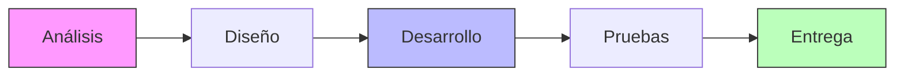
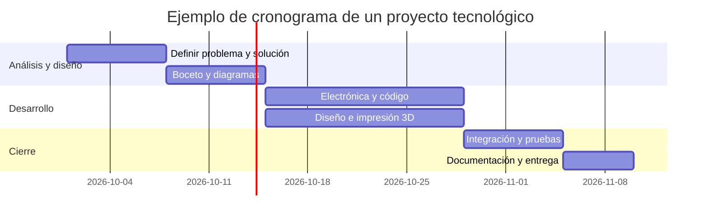
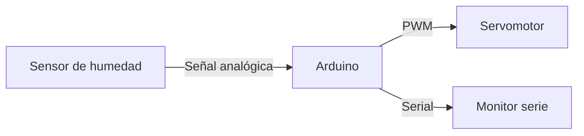
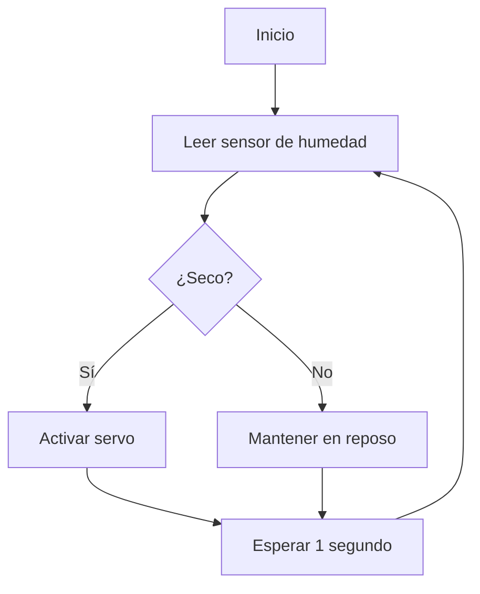
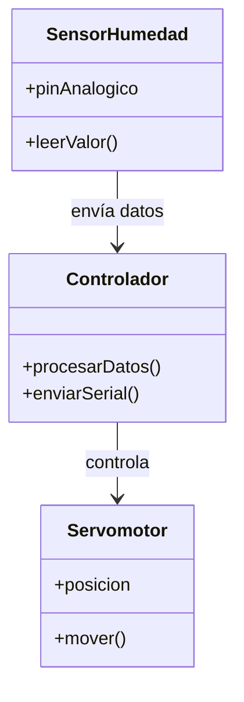
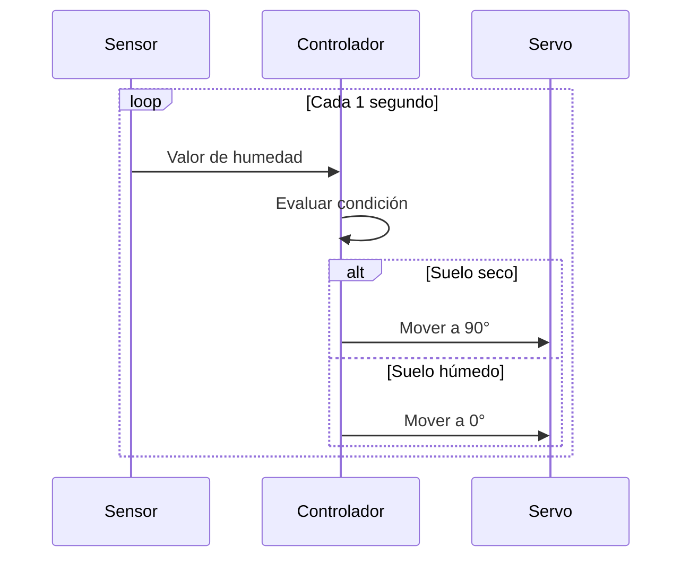
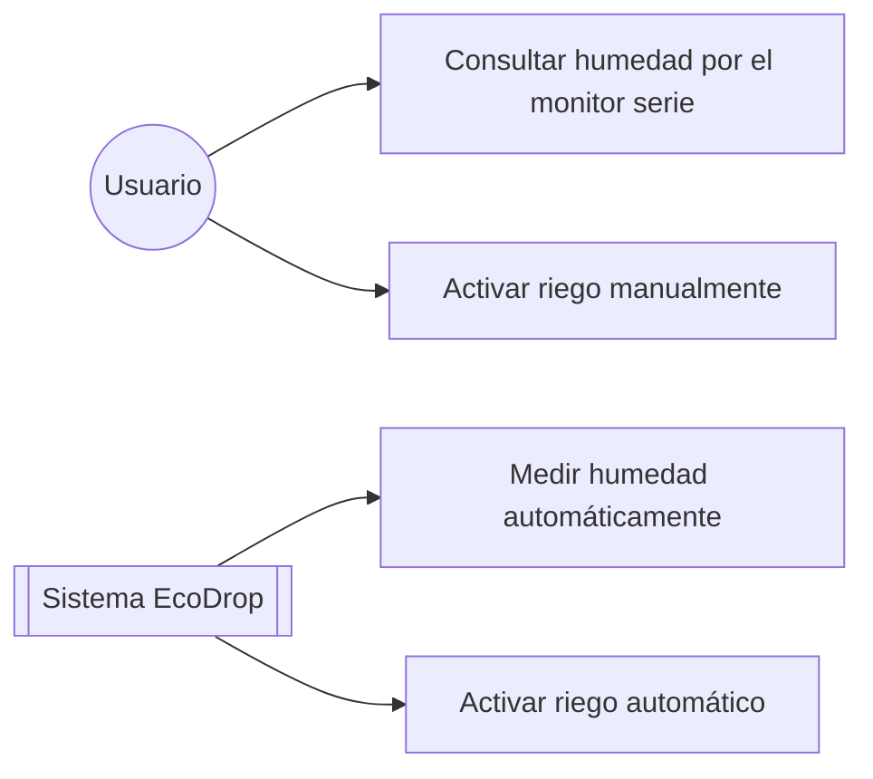
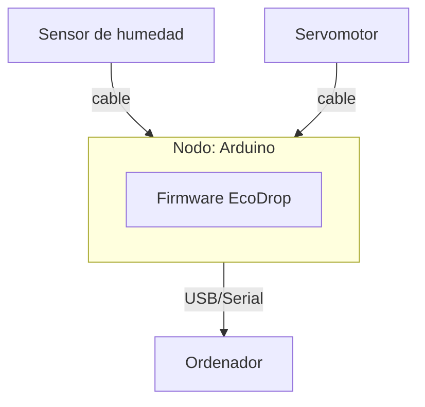
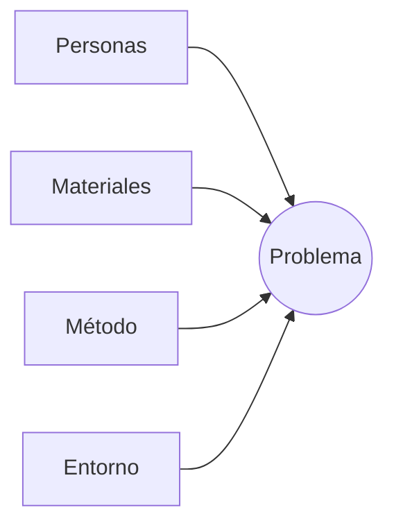
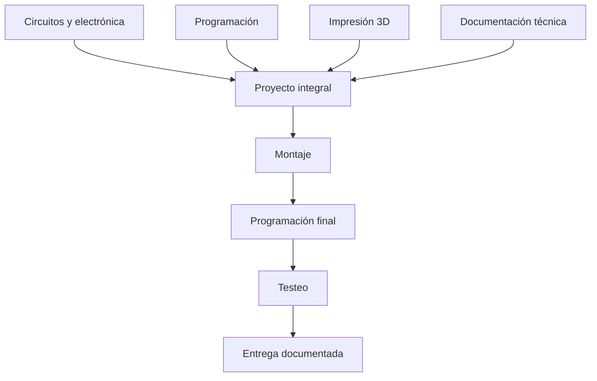

# UT · Proyectos Tecnológicos

**Módulo:** Informática aplicada a sistemas electrónicos (Robótica) · 1º SMR
**Profesor:** Ezequiel Llarena Borges

---

## Índice

1. [Fases del proyecto tecnológico](#fases)
2. [Metodología para la gestión de proyectos](#metodologia)
3. [Gestión de equipos y asignación de tareas](#equipos)
4. [Herramientas para el diseño gráfico y técnico](#herramientas)
5. [Planos de circuitos electrónicos y elementos mecánicos](#planos)
6. [Interpretación de esquemas y diagramas](#diagramas)
7. [Identificación de problemas y análisis de causas](#problemas)
8. [Definición de objetivos](#objetivos)
9. [Creatividad e innovación tecnológica](#creatividad)
10. [Documentación técnica](#documentacion)
11. [Proyecto tecnológico integral](#integral)

> Si tu visor de Markdown no permite pulsar los enlaces del índice, usa Ctrl/Cmd+F y busca el título del apartado.

---

## 1. Fases del proyecto tecnológico

Todo proyecto tecnológico recorre cinco grandes fases:

| Fase | Qué se hace | Resultado |
|---|---|---|
| **Análisis** | Identificar el problema, sus causas y las necesidades reales | Definición clara del problema |
| **Diseño** | Bocetar la solución, planos y diagramas | Boceto / planos / esquemas |
| **Desarrollo** | Construir el producto (electrónica, código, piezas) | Prototipo funcional |
| **Pruebas** | Validar que el producto cumple los objetivos | Producto depurado |
| **Entrega** | Documentar y presentar el resultado final | Memoria técnica + presentación |

---

## 2. Metodología para la gestión de proyectos

### Cascada vs. Ágil

| | Enfoque Cascada | Enfoque Ágil (Scrum) |
|---|---|---|
| Estructura | Fases secuenciales, una tras otra | Ciclos cortos (*sprints*) con entregas parciales |
| Cambios | Difíciles de introducir a mitad de proyecto | Se adaptan sprint a sprint |
| Entrega | Única, al final | Incrementos funcionales frecuentes |
| Recomendado para | Proyectos muy definidos de antemano | Proyectos con aprendizaje sobre la marcha (como el nuestro) |

### Planificación y cronograma

### Asignación de recursos

| Recurso | Ejemplos | Cuándo se planifica |
|---|---|---|
| Materiales | Placas, sensores, filamento 3D | Fase de diseño |
| Herramientas | IDE, software de diseño 3D, impresora | Fase de desarrollo |
| Tiempo | Horas por sprint/tarea | Al hacer el cronograma |
| Personas | Reparto de tareas del equipo | Fase de planificación |

---

## 3. Gestión de equipos y asignación de tareas

### Roles habituales en un equipo de proyecto

| Rol | Responsabilidad principal |
|---|---|
| Coordinador/a | Supervisa el cronograma y coordina al equipo |
| Responsable de electrónica | Montaje del circuito y programación del microcontrolador |
| Responsable de diseño 3D | Modelado e impresión de piezas |
| Responsable de documentación | Redacta la memoria técnica y prepara la presentación |

### Tablero Kanban de ejemplo

| Por hacer | En progreso | Hecho |
|---|---|---|
| Diseñar carcasa 3D | Montar circuito en protoboard | Definir problema y objetivos |
| Redactar manual de usuario | Programar el microcontrolador | Boceto inicial aprobado |

> El tablero se mueve de izquierda a derecha a medida que el equipo avanza; cada tarea lleva el nombre de quien la ejecuta.

---

## 4. Herramientas para el diseño gráfico y técnico

| Herramienta | Uso |
|---|---|
| **Tinkercad** | Diseño 3D de piezas y simulación básica de circuitos |
| **Fritzing** | Esquemas electrónicos y diseño de placas (PCB) |
| **FreeCAD** | Diseño mecánico y piezas más complejas |
| **Cura / PrusaSlicer** | Laminado del modelo 3D para la impresora |
| **Draw.io / Lucidchart** | Diagramas de flujo, UML y esquemas generales |
| **Arduino IDE** | Programación del microcontrolador |

---

## 5. Planos de circuitos electrónicos y elementos mecánicos

### Tipos de plano

| Tipo de plano | Qué representa |
|---|---|
| Esquema eléctrico/electrónico | Conexiones lógicas entre componentes (sin ubicación física) |
| Plano de PCB | Disposición física de pistas y componentes sobre la placa |
| Plano mecánico | Piezas, medidas y ensamblajes físicos de la carcasa/estructura |

### Ejemplo de esquema de conexión

### Símbolos electrónicos básicos

| Símbolo | Componente |
|---|---|
| ⏚ | Tierra (GND) |
| ─//─ | Resistencia |
| ⎓ | Fuente de alimentación / batería |
| ─▷│─ | Diodo LED |
| ⌇ | Interruptor / pulsador |

---

## 6. Interpretación de esquemas y diagramas

| Diagrama | Para qué sirve |
|---|---|
| Diagrama de flujo | Secuencia de decisiones y acciones del sistema |
| Diagrama de clases (UML) | Estructura del software: qué clases hay y cómo se relacionan |
| Diagrama de secuencia (UML) | Orden temporal en el que los componentes se comunican |
| Diagrama de casos de uso (UML) | Qué puede hacer el usuario con el sistema |
| Diagrama de despliegue (UML) | Cómo se distribuyen los componentes físicos (placa, sensores, servidor) |

Todos los ejemplos siguientes están basados en el mismo proyecto de referencia, **EcoDrop SMR**.

### 6.1 Diagrama de flujo

**Descripción:** representa, paso a paso, la secuencia de decisiones y acciones que sigue un algoritmo o proceso.

**Elementos principales:**
- Óvalo → inicio / fin
- Rectángulo → proceso o acción
- Rombo → decisión (bifurca el flujo)
- Flechas → dirección del flujo

**Ejemplo — lógica de riego de EcoDrop SMR:**

### 6.2 Diagrama de clases (UML)

**Descripción:** modela la estructura estática del software: qué clases existen, qué datos y comportamientos tiene cada una, y cómo se relacionan entre sí.

**Elementos principales:**
- Clase → nombre, atributos y métodos
- Relaciones → asociación, herencia, dependencia
- Visibilidad → pública (+) o privada (−)

**Ejemplo — software de EcoDrop SMR:**

### 6.3 Diagrama de secuencia (UML)

**Descripción:** muestra el orden temporal en el que los distintos componentes de un sistema se comunican entre sí mediante mensajes.

**Elementos principales:**
- Participantes → actores u objetos implicados
- Línea de vida → línea vertical bajo cada participante
- Mensajes → flechas horizontales entre líneas de vida
- Bloques `alt` / `loop` → condiciones y repeticiones

**Ejemplo — ciclo de lectura y riego de EcoDrop SMR:**

### 6.4 Diagrama de casos de uso (UML)

**Descripción:** representa qué puede hacer cada actor (usuario u otro sistema) con el sistema, sin entrar en el "cómo".

**Elementos principales:**
- Actor → figura que representa a quien interactúa con el sistema
- Caso de uso → óvalo con una funcionalidad concreta
- Límite del sistema → recuadro que agrupa los casos de uso
- Relaciones → asociación actor–caso de uso

**Ejemplo — usos de EcoDrop SMR:**

### 6.5 Diagrama de despliegue (UML)

**Descripción:** representa la arquitectura física del sistema: qué dispositivos hardware existen, qué software se ejecuta en cada uno y cómo se conectan.

**Elementos principales:**
- Nodo → dispositivo físico (placa, ordenador, servidor)
- Artefacto → software o firmware instalado en un nodo
- Conexión → relación de comunicación entre nodos (cable, USB, red)

**Ejemplo — hardware de EcoDrop SMR:**

---

## 7. Identificación de problemas y análisis de causas

### Métodos para identificar problemas

- **Observación directa**: detectar necesidades no cubiertas en el entorno cercano.
- **Brainstorming en equipo**: generar posibles problemas o mejoras sin filtrar ideas.
- **Los 5 porqués**: preguntar "¿por qué ocurre esto?" repetidamente hasta llegar a la causa raíz.

### Diagrama causa-efecto (Ishikawa) simplificado

| Causa | Ejemplo aplicado a "se mueren las plantas de la oficina" |
|---|---|
| Personas | Nadie tiene asignado el riego |
| Materiales | No hay sistema de riego automático |
| Método | No existe un calendario de riego |
| Entorno | Oficina con poca luz/humedad variable |

---

## 8. Definición de objetivos

Los objetivos de un proyecto tecnológico deben ser **SMART**:

| Letra | Significado | Aplicado al proyecto |
|---|---|---|
| S | Específico | "Medir la humedad del suelo y regar automáticamente" |
| M | Medible | "Activar el riego cuando la humedad baje de un umbral" |
| A | Alcanzable | Con los componentes y el tiempo disponibles en el aula |
| R | Relevante | Resuelve un problema real detectado en el análisis |
| T | Temporal | Con fecha de entrega por trimestre |

---

## 9. Creatividad e innovación tecnológica

### Técnicas de creatividad

| Técnica | En qué consiste |
|---|---|
| Brainstorming | Generar el máximo de ideas sin descartar ninguna al principio |
| SCAMPER | Sustituir, combinar, adaptar, modificar, dar otro uso, eliminar, reordenar una idea existente |
| Design Thinking | Empatía → Definición → Ideación → Prototipado → Testeo |

### Tendencias y retos de la innovación tecnológica

- Internet de las Cosas (IoT) y sensórica de bajo coste.
- Automatización y domótica accesible.
- Sostenibilidad: ahorro energético y de recursos.
- Fabricación digital (impresión 3D) para prototipado rápido.
- Reto principal: diseñar soluciones útiles con recursos y tiempo limitados.

### Ejemplos de soluciones innovadoras

- Riego automático que ahorra agua y tiempo de mantenimiento.
- Persianas que se regulan solas según la luz, ahorrando energía.
- Sistemas de alarma de bajo coste con componentes accesibles.

---

## 10. Documentación técnica

### Estructura habitual de una memoria técnica

1. Portada e índice
2. Introducción y justificación del proyecto
3. Objetivos
4. Análisis del problema
5. Diseño de la solución (planos, esquemas, diagramas)
6. Desarrollo (montaje, código comentado)
7. Pruebas realizadas y resultados
8. Conclusiones
9. Anexos (código completo, planos, bibliografía)

### Manual de usuario — contenido mínimo

| Apartado | Contenido |
|---|---|
| Descripción | Qué hace el dispositivo, en una frase |
| Puesta en marcha | Cómo encenderlo/conectarlo |
| Uso | Qué hace cada indicador o control |
| Mantenimiento | Qué revisar y con qué frecuencia |

### Herramientas de documentación colaborativa

| Herramienta | Uso |
|---|---|
| Google Docs | Redacción colaborativa en tiempo real |
| GitHub / GitLab | Control de versiones del código y la documentación en Markdown |
| Notion | Organización de tareas y documentación en un mismo espacio |
| Trello | Seguimiento visual del tablero Kanban del equipo |

---

## 11. Proyecto tecnológico integral

El proyecto final integra **todo lo aprendido durante el curso**:

| Bloque de conocimiento | Aporta al proyecto |
|---|---|
| Circuitos | Montaje del hardware (sensores, actuadores) |
| Programación | Lógica de control del sistema |
| Impresión 3D | Carcasa o estructura física |
| Documentación | Memoria técnica y manual de usuario |

**Ejemplo de referencia:** *EcoDrop SMR*, sistema de riego automatizado con Arduino que combina sensor de humedad, servomotor y carcasa impresa en 3D, desarrollado en tres sprints (electrónica y código → diseño 3D → integración y pruebas).

---

*Profesor: Ezequiel Llarena Borges · Informática aplicada a sistemas electrónicos (Robótica) · 1º SMR*
